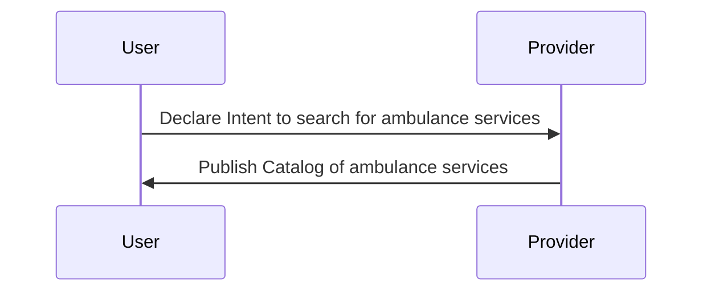
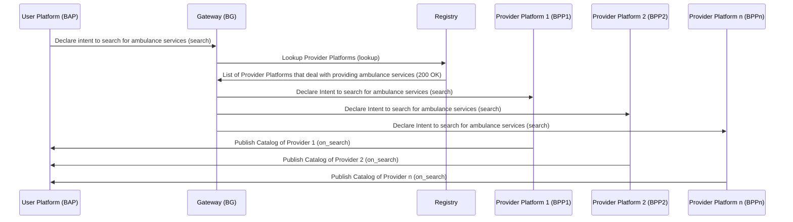
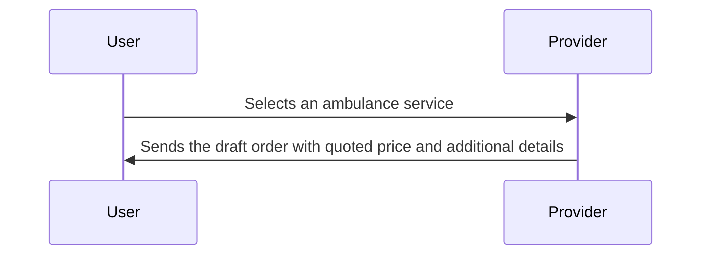
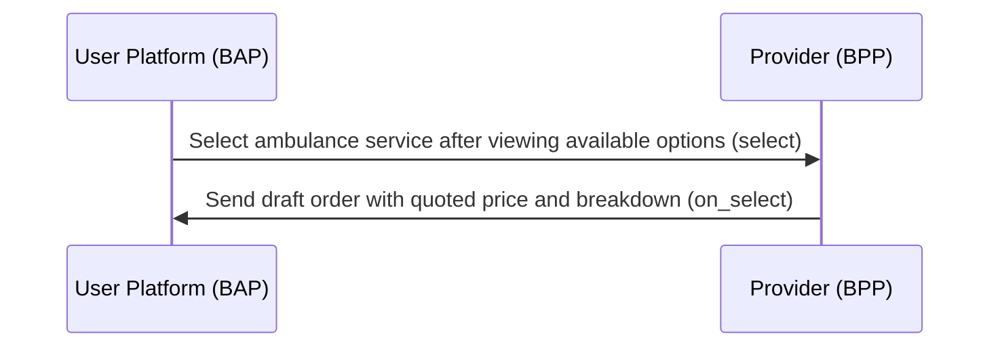
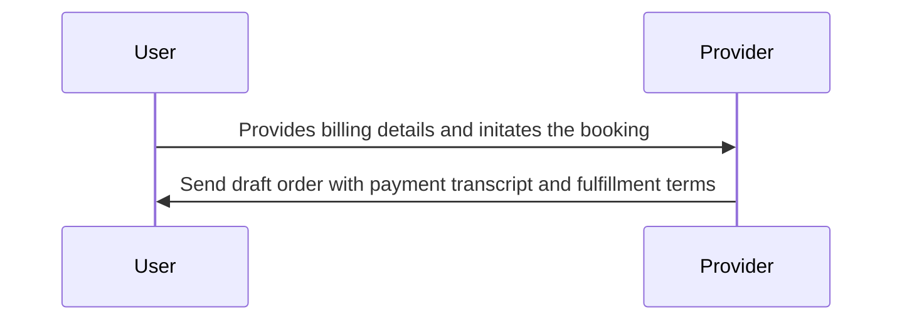
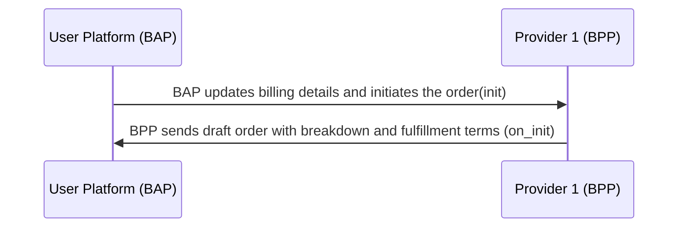
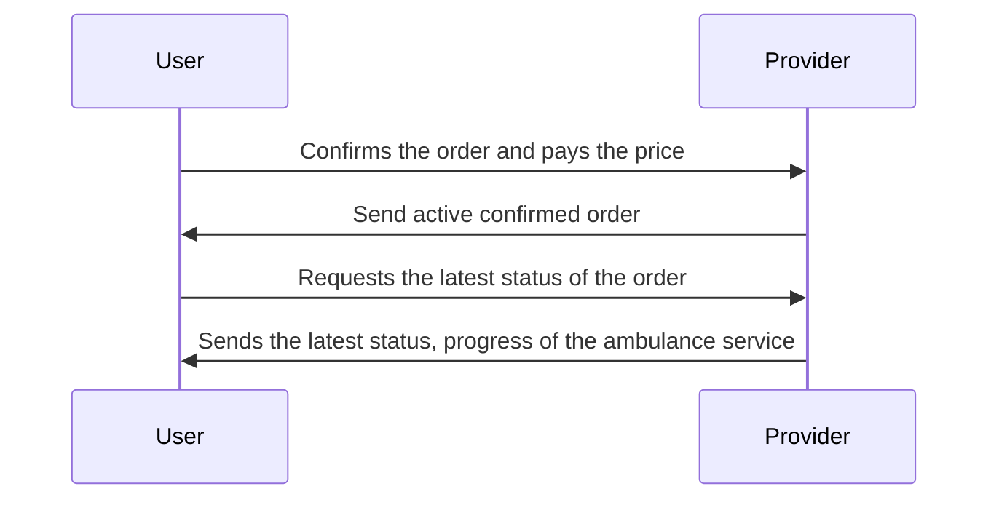
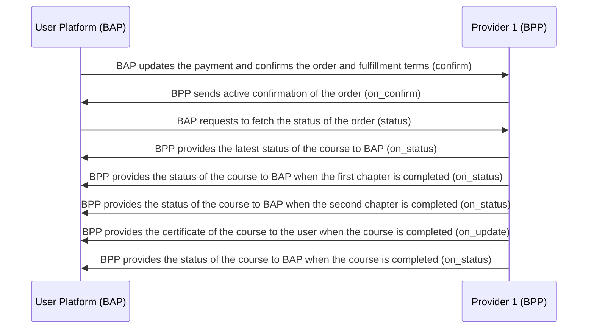

# Ambulance Booking Workflow

### Overview

This document outlines the workflow for ambulance booking using BPP (Ambulance Booking Platform Provider) and BAP (Ambulance Booking App). The workflow includes interactions between the user (patient or their representative) and the ambulance service provider (BPP) for requesting, confirming, and completing ambulance bookings.

A typical workflow for ambulance booking consists of the following steps:

**Step 1: BAP user requests an ambulance** \
The BAP user initiates the process by requesting an ambulance through the BAP. The request can be made through the BAP mobile app or website, where the user provides details such as the pickup location, drop-off location, nature of the emergency and any special requirements (Eg: medical equipment)

**Step 2: BPP sends available ambulance options** \
BPP, the Ambulance Booking Platform Provider, retrieves a list of available ambulances from various ambulance service providers (BPPs) based on the user's location and requirements. The list includes details such as ambulance type (Eg: basic life support, advanced life support), estimated arrival time and cost estimates

**Step 3: BAP user selects an ambulance** \
The BAP user reviews the available ambulance options and selects the one that best suits their needs. They may consider factors like response time, ambulance type, and cost

**Step 4: BPP confirms the booking** \
Upon receiving the BAP user's request and selection, the chosen BPP confirms the ambulance booking. This confirmation includes information about the assigned ambulance unit, crew, and estimated time of arrival

**Step 5: BAP user provides necessary details** \
The BAP user is prompted to provide essential information, including the patient's name, medical condition (if known), contact information and any specific instructions for the ambulance crew

**Step 6: BPP dispatches the ambulance** \
The BPP dispatches the confirmed ambulance to the BAP user's specified pickup location. The ambulance crew is informed of the user's details and any special instructions

**Step 7: BAP user tracks the ambulance** \
The BAP provides a tracking feature that allows the user to monitor the ambulance's real-time location and estimated time of arrival. This feature ensures transparency and reassures the user

**Step 8: BPP updates on ambulance arrival** \
Once the ambulance arrives at the pickup location, the BPP sends a notification to the BAP user, confirming the arrival of the ambulance and providing instructions for safe and efficient patient transfer

**Step 9: BAP user acknowledges ambulance arrival** \
The BAP user acknowledges the arrival of the ambulance through the BAP. This steps helps the BPP ensure that the user is ready for the patient's transfer

**Step 10: BPP transports the patient** \
The ambulance crew transports the patient to the designated healthcare facility or destination. During the journey, the BAP may provide updates on the patient's condition and estimated time of arrival at the destination

**Step 11: BPP completes the ambulance service** \
Upon reaching the destination, the ambulance crew completes the service by safely transferring the patient to the healthcare facility or handing over to the receiving party, if applicable

**Step 12: BAP user provides feedback and payment** \
After the service is completed, the BAP user has the option to provide feedback on the ambulance service quality. They may also make payment for the ambulance service through the BAP

**Step 13: BPP sends service completion details** \
The BPP sends service completion details to the BAP user, including a summary of the trip, any charges incurred and a receipt for payment

## Search (Searching for Ambulance Services)

The user declares the intent for ambulance services
Providers publish the catalog of their ambulance services
User-side Actions

A user in need of ambulance services can declare their intent to book an ambulance in various ways, including:

- Searching for ambulance services based on service (patient) type
- Searching for ambulance services based on location
- Searching for ambulance services based on emergency or non-emergency requirements
- Searching for ambulance services having particular facilities

### Provider-side Actions

In this interaction, ambulance service providers (BPPs) publish their catalog of ambulance services, which are categorized based on service types and fulfillments



### Beckn Protocol API Workflow

In the Beckn protocol, the search intent generated by the Ambulance Booking App (BAP) is typically published on the gateway (BG) that broadcasts the intent to multiple Ambulance Service Provider platforms (BPPs). Each of the BPPs returns their catalogs of available ambulance services directly to the BAP via asynchronous callbacks. The workflow for this process is illustrated below



#### Example `search` request

```json
{
  "context": {
    "domain": "dhp:0.7.3",
    "location": {
      "country": {
        "code": "IND"
      }
    },
    "transaction_id": "a9aaecca-10b7-4d19-b640-b047a7c62196",
    "message_id": "$bb579fb8-cb82-4824-be12-fcbc405b6608",
    "action": "search",
    "timestamp": "2023-05-25T05:23:03.443Z",
    "version": "1.1.0",
    "bap_uri": "https://dhp-network-bap.becknprotocol.io/",
    "bap_id": "dhp-bap.becknprotocol.io",
    "ttl": "PT10M"
  },
  "message": {
    "intent": {
      "category": {
        "descriptor": {
          "code": "ambulance-service"
        }
      },
      "fulfillment": {
        "type": "EMERGENCY",
        "stops": [
          {
            "type": "START",
            "time": {
              "label": "scheduled-time",
              "timestamp": "2023-09-15T08:00:00Z"
            },
            "location": {
              "gps": "12.423423,77.325647"
            }
          },
          {
            "type": "END",
            "location": {
              "gps": "12.423483,77.325697"
            }
          }
        ]
      }
    }
  }
}
```

#### Example `on_search` request

```json
{
  "context": {
    "domain": "dhp:0.7.3",
    "location": {
      "country": {
        "code": "IND"
      }
    },
    "transaction_id": "a9aaecca-10b7-4d19-b640-b047a7c62196",
    "message_id": "$bb579fb8-cb82-4824-be12-fcbc405b6608",
    "action": "on_search",
    "timestamp": "2023-05-25T05:23:03.443Z",
    "version": "1.1.0",
    "bap_uri": "https://dhp-network-bap.becknprotocol.io/",
    "bap_id": "dhp-bap.becknprotocol.io",
    "bpp_uri": "https://dhp-network-bpp.becknprotocol.io/",
    "bpp_id": "dhp-bpp.becknprotocol.io",
    "ttl": "PT10M"
  },
  "message": {
    "catalog": {
      "descriptor": {
        "name": "Available Ambulance Services"
      },
      "providers": [
        {
          "id": "4ab0cbbc-f246-4199-96c9-28a776d46c60",
          "descriptor": {
            "name": "Alpha Ambulance Services",
            "short_desc": "Alpha Ambulance Services Pvt Ltd",
            "images": [
              {
                "url": "https://alphaambulanceservices.in/images/logo.png"
              }
            ]
          },
          "categories": [
            {
              "id": "amb-service-01",
              "descriptor": {
                "code": "basic-ambulance",
                "name": "Basic Ambulance Service"
              }
            },
            {
              "id": "amb-service-02",
              "descriptor": {
                "code": "advance-ambulance",
                "name": "Advance Ambulance Services"
              }
            },
            {
              "id": "amb-service-03",
              "descriptor": {
                "code": "air-ambulance",
                "name": "Air Ambulance Services"
              }
            },
            {
              "id": "amb-service-04",
              "descriptor": {
                "code": "mortuary-ambulance",
                "name": "Mortuary Ambulance Services"
              }
            }
          ],
          "locations": [
            {
              "id": "amb-loc-01",
              "gps": "12.9164682,77.6089985"
            },
            {
              "id": "amb-loc-02",
              "gps": "12.91671,77.6092983"
            },
            {
              "id": "amb-loc-03",
              "gps": "12.9165733,77.6152167"
            }
          ],
          "fulfillments": [
            {
              "id": "ab-ful-01",
              "type": "EMERGENCY",
              "vehicle": {
                "category": "pediatric"
              },
              "stops": [
                {
                  "type": "start",
                  "time": {
                    "timestamp": "2023-09-15T08:00:00Z"
                  }
                },
                {
                  "type": "end",
                  "time": {
                    "timestamp": "2023-09-15T08:30:00Z"
                  }
                }
              ]
            },
            {
              "id": "ab-ful-02",
              "type": "NON-EMERGENCY",
              "vehicle": {
                "category": "icu"
              },
              "stops": [
                {
                  "type": "start",
                  "time": {
                    "timestamp": "2023-09-15T09:00:00Z"
                  }
                },
                {
                  "type": "end",
                  "time": {
                    "timestamp": "2023-09-15T09:30:00Z"
                  }
                }
              ]
            }
          ],
          "items": [
            {
              "id": "855e60b4-05f8-4e71-86be-c7facae7d61d",
              "descriptor": {
                "code": "neonatal-life-support",
                "name": "Neonatal Life Supoprt"
              },
              "price": {
                "value": "12000",
                "currency": "INR"
              },
              "add_ons": [
                {
                  "id": "f31ca7cd-b1f1-4b46-b6b8-7c6432e32261",
                  "descriptor": {
                    "code": "oxygen-suuport",
                    "name": "Basic Oxygen Support"
                  },
                  "price": {
                    "value": "10000",
                    "currency": "INR"
                  }
                }
              ],
              "category_ids": ["amb-service-01"],
              "location_ids": ["amb-loc-01"],
              "fulfillment_ids": ["ab-ful-02"]
            },
            {
              "id": "35230bc4-b966-43ae-bc01-79593ed49217",
              "descriptor": {
                "code": "advanced-life-support",
                "name": "Advanced Life Support"
              },
              "price": {
                "value": "45000",
                "currency": "INR"
              },
              "add_ons": [
                {
                  "id": "f31ca7cd-b1f1-4b46-b6b8-7c6432e32261",
                  "descriptor": {
                    "code": "oxygen-suuport",
                    "name": "Basic Oxygen Support"
                  },
                  "price": {
                    "value": "10000",
                    "currency": "INR"
                  }
                },
                {
                  "id": "02667b93-4224-49e7-9a64-e4e4b88dba48",
                  "descriptor": {
                    "code": "cpr-suuport",
                    "name": "CPR Support"
                  },
                  "price": {
                    "value": "10000",
                    "currency": "INR"
                  }
                }
              ],
              "category_ids": ["amb-service-02"],
              "location_ids": ["amb-loc-01"],
              "fulfillment_ids": ["ab-ful-01"]
            },
            {
              "id": "2e48d6c1-8151-43ae-bdb0-9584a731aa49",
              "descriptor": {
                "code": "mortuary-ambulance",
                "name": "Mortuary Ambulance Services"
              },
              "price": {
                "value": "15000",
                "currency": "INR"
              },
              "category_ids": ["amb-service-04"],
              "location_ids": ["amb-loc-01"],
              "fulfillment_ids": ["ab-ful-01"]
            }
          ]
        }
      ]
    }
  }
}
```

## Select an Ambulance Service for Booking

User selects an ambulance service from the list that satisfies their requirements.
The provider sends the draft order with the interim quote to the user, along with additional details of the selected ambulance service.

### User-side Actions

Selecting an ambulance service from the available options.

### Provider-side Actions

Receiving the user's selection of an ambulance service.
Sending a draft order to the user with a quoted price and detailed information about the selected ambulance service.

### Logical Workflow

The diagram below illustrates the logical interactions between a user and a provider during the ambulance service selection stage:



### Beckn Protocol API Workflow



### Example `select` request

```json
{
  "context": {
    "domain": "dhp:0.7.3",
    "location": {
      "country": {
        "code": "IND"
      }
    },
    "transaction_id": "a9aaecca-10b7-4d19-b640-b047a7c62196",
    "message_id": "$bb579fb8-cb82-4824-be12-fcbc405b6608",
    "action": "select",
    "timestamp": "2023-05-25T05:23:03.443Z",
    "version": "1.1.0",
    "bap_uri": "https://dhp-network-bap.becknprotocol.io/",
    "bap_id": "dhp-bap.becknprotocol.io",
    "bpp_uri": "https://dhp-network-bpp.becknprotocol.io/",
    "bpp_id": "dhp-bpp.becknprotocol.io",
    "ttl": "PT10M"
  },
  "message": {
    "order": {
      "provider": {
        "id": "4ab0cbbc-f246-4199-96c9-28a776d46c60"
      },
      "items": [
        {
          "id": "35230bc4-b966-43ae-bc01-79593ed49217",
          "add_ons": [
            {
              "id": "f31ca7cd-b1f1-4b46-b6b8-7c6432e32261"
            }
          ]
        }
      ],
      "fulfillment": [
        {
          "id": "ab-ful-01",
          "type": "EMERGENCY",
          "stops": [
            {
              "type": "START",
              "time": {
                "label": "scheduled-time",
                "timestamp": "2023-09-15T08:00:00Z"
              },
              "location": {
                "gps": "12.423423,77.325647"
              }
            },
            {
              "type": "END",
              "location": {
                "gps": "12.423483,77.325697"
              }
            }
          ]
        }
      ]
    }
  }
}
```

### Example `on_select` request

```json
{
  "context": {
    "domain": "dhp:0.7.3",
    "location": {
      "country": {
        "code": "IND"
      }
    },
    "transaction_id": "a9aaecca-10b7-4d19-b640-b047a7c62196",
    "message_id": "$bb579fb8-cb82-4824-be12-fcbc405b6608",
    "action": "on_select",
    "timestamp": "2023-05-25T05:23:03.443Z",
    "version": "1.1.0",
    "bap_uri": "https://dhp-network-bap.becknprotocol.io/",
    "bap_id": "dhp-bap.becknprotocol.io",
    "bpp_uri": "https://dhp-network-bpp.becknprotocol.io/",
    "bpp_id": "dhp-bpp.becknprotocol.io",
    "ttl": "PT10M"
  },
  "message": {
    "order": {
      "provider": {
        "id": "4ab0cbbc-f246-4199-96c9-28a776d46c60",
        "descriptor": {
          "name": "Alpha Ambulance Services",
          "short_desc": "Alpha Ambulance Services Pvt Ltd",
          "images": [
            {
              "url": "https://alphaambulanceservices.in/images/logo.png"
            }
          ]
        }
      },
      "items": [
        {
          "id": "35230bc4-b966-43ae-bc01-79593ed49217",
          "descriptor": {
            "code": "advanced-life-support",
            "name": "Advanced Life Support"
          },
          "price": {
            "value": "45000",
            "currency": "INR"
          },
          "add_ons": [
            {
              "id": "f31ca7cd-b1f1-4b46-b6b8-7c6432e32261",
              "descriptor": {
                "code": "oxygen-suuport",
                "name": "Basic Oxygen Support"
              },
              "price": {
                "value": "10000",
                "currency": "INR"
              }
            }
          ]
        }
      ],
      "fulfillment": [
        {
          "id": "ab-ful-01",
          "type": "EMERGENCY",
          "agent": {
            "person": {
              "id": "f31ca7cd",
              "name": "Mr Antony Gonsalves"
            }
          },
          "stops": [
            {
              "type": "START",
              "time": {
                "label": "scheduled-time",
                "timestamp": "2023-09-15T08:00:00Z"
              },
              "location": {
                "gps": "12.423423,77.325647"
              }
            },
            {
              "type": "END",
              "location": {
                "gps": "12.423483,77.325697"
              }
            }
          ]
        }
      ],
      "quote": {
        "price": {
          "value": "55000",
          "currency": "INR"
        },
        "breakup": [
          {
            "title": "advanced-life-support",
            "price": {
              "currency": "INR",
              "value": "45000"
            }
          },
          {
            "title": "oxygen-support-add-on",
            "price": {
              "currency": "INR",
              "value": "10000"
            }
          }
        ]
      }
    }
  }
}
```

### Order (Ambulance Booking) Initialization

In this stage, the User provides the required information and initiates the booking

#### User-side Actions

- User provides the billing details `Name`, `Email ID` and `Phone Number`
- User updates the payment details and initiates the booking

#### Provider-side Actions

- Request for billing details
- Receive billing details from the user
- Send draft order with payment and fulfillment terms

#### Logical Workflow



#### Beckn Protocol API Workflow



#### Example `init` request

```json
{
  "context": {
    "domain": "dhp:0.7.3",
    "location": {
      "country": {
        "code": "IND"
      }
    },
    "transaction_id": "a9aaecca-10b7-4d19-b640-b047a7c62196",
    "message_id": "$bb579fb8-cb82-4824-be12-fcbc405b6608",
    "action": "init",
    "timestamp": "2023-05-25T05:23:03.443Z",
    "version": "1.1.0",
    "bap_uri": "https://dhp-network-bap.becknprotocol.io/",
    "bap_id": "dhp-bap.becknprotocol.io",
    "bpp_uri": "https://dhp-network-bpp.becknprotocol.io/",
    "bpp_id": "dhp-bpp.becknprotocol.io",
    "ttl": "PT10M"
  },
  "message": {
    "order": {
      "provider": {
        "id": "4ab0cbbc-f246-4199-96c9-28a776d46c60"
      },
      "items": [
        {
          "id": "35230bc4-b966-43ae-bc01-79593ed49217",
          "add_ons": [
            {
              "id": "f31ca7cd-b1f1-4b46-b6b8-7c6432e32261"
            }
          ]
        }
      ],
      "fulfillment": [
        {
          "id": "ab-ful-01",
          "type": "EMERGENCY",
          "customer": {
            "person": {
              "id": "patient-123",
              "name": "Mr John Smith",
              "creds": [
                {
                  "url": "john.smith@example.com"
                }
              ]
            }
          },
          "stops": [
            {
              "type": "START",
              "time": {
                "label": "scheduled-time",
                "timestamp": "2023-09-15T08:00:00Z"
              },
              "location": {
                "gps": "12.423423,77.325647"
              }
            },
            {
              "type": "END",
              "location": {
                "gps": "12.423483,77.325697"
              }
            }
          ]
        }
      ],
      "billing": {
        "name": "John Doe",
        "address": "Door 12, Salarpuria Greenage, Street No 7, Hosur Road, 560068",
        "email": "john.doe@example.com",
        "phone": "+91-9999999999"
      }
    }
  }
}
```

#### Example `on_init` request

```json
{
  "context": {
    "domain": "dhp:0.7.3",
    "location": {
      "country": {
        "code": "IND"
      }
    },
    "transaction_id": "a9aaecca-10b7-4d19-b640-b047a7c62196",
    "message_id": "$bb579fb8-cb82-4824-be12-fcbc405b6608",
    "action": "on_init",
    "timestamp": "2023-05-25T05:23:03.443Z",
    "version": "1.1.0",
    "bap_uri": "https://dhp-network-bap.becknprotocol.io/",
    "bap_id": "dhp-bap.becknprotocol.io",
    "bpp_uri": "https://dhp-network-bpp.becknprotocol.io/",
    "bpp_id": "dhp-bpp.becknprotocol.io",
    "ttl": "PT10M"
  },
  "message": {
    "order": {
      "provider": {
        "id": "4ab0cbbc-f246-4199-96c9-28a776d46c60",
        "descriptor": {
          "name": "Alpha Ambulance Services",
          "short_desc": "Alpha Ambulance Services Pvt Ltd",
          "images": [
            {
              "url": "https://alphaambulanceservices.in/images/logo.png"
            }
          ]
        }
      },
      "items": [
        {
          "id": "35230bc4-b966-43ae-bc01-79593ed49217",
          "descriptor": {
            "code": "advanced-life-support",
            "name": "Advanced Life Support"
          },
          "price": {
            "value": "45000",
            "currency": "INR"
          },
          "add_ons": [
            {
              "id": "f31ca7cd-b1f1-4b46-b6b8-7c6432e32261",
              "descriptor": {
                "code": "oxygen-suuport",
                "name": "Basic Oxygen Support"
              },
              "price": {
                "value": "10000",
                "currency": "INR"
              }
            }
          ]
        }
      ],
      "fulfillment": [
        {
          "id": "ab-ful-01",
          "type": "EMERGENCY",
          "customer": {
            "person": {
              "id": "patient-123",
              "name": "Mr John Smith",
              "creds": [
                {
                  "url": "john.smith@example.com"
                }
              ]
            }
          },
          "agent": {
            "person": {
              "id": "f31ca7cd",
              "name": "Mr Antony Gonsalves"
            }
          },
          "stops": [
            {
              "type": "START",
              "time": {
                "label": "scheduled-time",
                "timestamp": "2023-09-15T08:00:00Z"
              },
              "location": {
                "gps": "12.423423,77.325647"
              }
            },
            {
              "type": "END",
              "location": {
                "gps": "12.423483,77.325697"
              }
            }
          ],
          "state": {
            "descriptor": {
              "code": "order-initiated",
              "name": "Ambulance booking has been initiated"
            }
          }
        }
      ],
      "quote": {
        "price": {
          "value": "55000",
          "currency": "INR"
        },
        "breakup": [
          {
            "title": "advanced-life-support",
            "price": {
              "currency": "INR",
              "value": "45000"
            }
          },
          {
            "title": "oxygen-support-add-on",
            "price": {
              "currency": "INR",
              "value": "10000"
            }
          }
        ]
      },
      "billing": {
        "name": "John Doe",
        "address": "Door 12, Salarpuria Greenage, Street No 7, Hosur Road, 560068",
        "email": "john.doe@example.com",
        "phone": "+91-9999999999"
      },
      "payments": [
        {
          "type": "PRE-FULFILLMENT",
          "status": "NOT-PAID",
          "params": {
            "url": "payto://ban/1234567890?amount=INR:55000&ifsc=ABCD0000123&message=ambulance-payment",
            "amount": "55000",
            "currency": "INR"
          }
        }
      ],
      "cancellation_terms": [
        {
          "fulfillment_state": {
            "descriptor": {
              "code": "in-progress"
            }
          },
          "cancellation_fee": {
            "percentage": "30%"
          },
          "external_ref": {
            "mimetype": "text/html",
            "url": "https://alphaambulances.in/charge/tnc.html"
          }
        }
      ]
    }
  }
}
```

## Ambulance Booking Order Confirmation

This Beckn Protocol API Workflow covers the process of confirming an ambulance booking order and providing status updates to the user

### User side Actions:

- Confirms the order: The user confirms the ambulance booking order by agreeing to the fulfillment terms and completing the payment.
- Requests the latest status: The user requests the latest status of the order and the progress of the ambulance service.

### Provider-side Actions:

- Receive order confirmation: The provider platform (BPP) receives the order confirmation from the user and processes it.
- Send active confirmed order: After confirming the order, the provider sends an active confirmation of the order to the user's Beckn Application Platform (BAP).
- Provide the latest status: The provider responds to the user's request for the latest status of the ambulance service. This can include information about the service's current status, location, estimated time of arrival, and other relevant details.
- Progress updates: The provider sends status updates (on_status) to the user when specific milestones are reached. For example, when the ambulance starts its journey, when it arrives at the pickup location, and when it reaches the destination.
- Course completion notification: When the ambulance service is completed, the provider sends an update (on_update) to notify the user of the service's completion and potentially provide any necessary documents or certificates.

### Logical Workflow:

The logical workflow of this interaction is represented in the following sequence diagram:



### Beckn Protocol API Workflow:

In this API workflow, the user's Beckn Application Platform (BAP) initiates the confirmation (confirm) of the ambulance booking order, and the provider's Beckn Provider Platform (BPP) responds with an active confirmation (on_confirm). Subsequently, the user can request status updates (status), and the provider sends status updates (on_status) at various stages of the ambulance service, including completion. The final step involves providing the certificate and additional status updates (on_update) upon course completion



In this API workflow, the user's Beckn Application Platform (BAP) initiates the confirmation (confirm) of the ambulance booking order, and the provider's Beckn Provider Platform (BPP) responds with an active confirmation (on_confirm). Subsequently, the user can request status updates (status), and the provider sends status updates (on_status) at various stages of the ambulance service, including completion. The final step involves providing the certificate and additional status updates (on_update) upon course completion

#### Example `confirm` request

```json
{
  "context": {
    "domain": "dhp:0.7.3",
    "location": {
      "country": {
        "code": "IND"
      }
    },
    "transaction_id": "a9aaecca-10b7-4d19-b640-b047a7c62196",
    "message_id": "$bb579fb8-cb82-4824-be12-fcbc405b6608",
    "action": "confirm",
    "timestamp": "2023-05-25T05:23:03.443Z",
    "version": "1.1.0",
    "bap_uri": "https://dhp-network-bap.becknprotocol.io/",
    "bap_id": "dhp-bap.becknprotocol.io",
    "bpp_uri": "https://dhp-network-bpp.becknprotocol.io/",
    "bpp_id": "dhp-bpp.becknprotocol.io",
    "ttl": "PT10M"
  },
  "message": {
    "order": {
      "provider": {
        "id": "4ab0cbbc-f246-4199-96c9-28a776d46c60"
      },
      "items": [
        {
          "id": "35230bc4-b966-43ae-bc01-79593ed49217",
          "add_ons": [
            {
              "id": "f31ca7cd-b1f1-4b46-b6b8-7c6432e32261"
            }
          ]
        }
      ],
      "fulfillment": [
        {
          "id": "ab-ful-01",
          "type": "EMERGENCY",
          "customer": {
            "person": {
              "id": "patient-123",
              "name": "Mr John Smith",
              "creds": [
                {
                  "url": "john.smith@example.com"
                }
              ]
            }
          },
          "stops": [
            {
              "type": "START",
              "time": {
                "label": "scheduled-time",
                "timestamp": "2023-09-15T08:00:00Z"
              },
              "location": {
                "gps": "12.423423,77.325647"
              }
            },
            {
              "type": "END",
              "location": {
                "gps": "12.423483,77.325697"
              }
            }
          ]
        }
      ],
      "billing": {
        "name": "John Doe",
        "address": "Door 12, Salarpuria Greenage, Street No 7, Hosur Road, 560068",
        "email": "john.doe@example.com",
        "phone": "+91-9999999999"
      },
      "payments": [
        {
          "type": "PRE-FULFILLMENT",
          "status": "PAID",
          "params": {
            "amount": "55000",
            "currency": "INR",
            "transaction_id": "bb579fb8-cb82-4824-be12-fcbc405b6608"
          }
        }
      ]
    }
  }
}
```

### Example `on_confirm` request

```json
{
  "context": {
    "domain": "dhp:0.7.3",
    "location": {
      "country": {
        "code": "IND"
      }
    },
    "transaction_id": "a9aaecca-10b7-4d19-b640-b047a7c62196",
    "message_id": "$bb579fb8-cb82-4824-be12-fcbc405b6608",
    "action": "on_confirm",
    "timestamp": "2023-05-25T05:23:03.443Z",
    "version": "1.1.0",
    "bap_uri": "https://dhp-network-bap.becknprotocol.io/",
    "bap_id": "dhp-bap.becknprotocol.io",
    "bpp_uri": "https://dhp-network-bpp.becknprotocol.io/",
    "bpp_id": "dhp-bpp.becknprotocol.io",
    "ttl": "PT10M"
  },
  "message": {
    "order": {
      "id": "3210fedcba98",
      "provider": {
        "id": "4ab0cbbc-f246-4199-96c9-28a776d46c60",
        "descriptor": {
          "name": "Alpha Ambulance Services",
          "short_desc": "Alpha Ambulance Services Pvt Ltd",
          "images": [
            {
              "url": "https://alphaambulanceservices.in/images/logo.png"
            }
          ]
        }
      },
      "items": [
        {
          "id": "35230bc4-b966-43ae-bc01-79593ed49217",
          "descriptor": {
            "code": "advanced-life-support",
            "name": "Advanced Life Support"
          },
          "price": {
            "value": "45000",
            "currency": "INR"
          },
          "add_ons": [
            {
              "id": "f31ca7cd-b1f1-4b46-b6b8-7c6432e32261",
              "descriptor": {
                "code": "oxygen-suuport",
                "name": "Basic Oxygen Support"
              },
              "price": {
                "value": "10000",
                "currency": "INR"
              }
            }
          ]
        }
      ],
      "fulfillment": [
        {
          "id": "ab-ful-01",
          "type": "EMERGENCY",
          "customer": {
            "person": {
              "id": "patient-123",
              "name": "Mr John Smith",
              "creds": [
                {
                  "url": "john.smith@example.com"
                }
              ]
            }
          },
          "agent": {
            "person": {
              "id": "f31ca7cd",
              "name": "Mr Antony Gonsalves"
            }
          },
          "stops": [
            {
              "type": "START",
              "time": {
                "label": "scheduled-time",
                "timestamp": "2023-09-15T08:00:00Z"
              },
              "location": {
                "gps": "12.423423,77.325647"
              }
            },
            {
              "type": "END",
              "location": {
                "gps": "12.423483,77.325697"
              }
            },
            {
              "time": {
                "label": "estimated-time",
                "timestamp": "2023-09-15T07:50:00Z"
              }
            }
          ],
          "state": {
            "descriptor": {
              "code": "order-confirmed",
              "name": "Ambulance booking has been confirmed"
            }
          }
        }
      ],
      "quote": {
        "price": {
          "value": "55000",
          "currency": "INR"
        },
        "breakup": [
          {
            "title": "advanced-life-support",
            "price": {
              "currency": "INR",
              "value": "45000"
            }
          },
          {
            "title": "oxygen-support-add-on",
            "price": {
              "currency": "INR",
              "value": "10000"
            }
          }
        ]
      },
      "billing": {
        "name": "John Doe",
        "address": "Door 12, Salarpuria Greenage, Street No 7, Hosur Road, 560068",
        "email": "john.doe@example.com",
        "phone": "+91-9999999999"
      },
      "payments": [
        {
          "type": "PRE-FULFILLMENT",
          "status": "PAID",
          "params": {
            "amount": "55000",
            "currency": "INR",
            "transaction_id": "bb579fb8-cb82-4824-be12-fcbc405b6608"
          }
        }
      ],
      "cancellation_terms": [
        {
          "fulfillment_state": {
            "descriptor": {
              "code": "in-progress"
            }
          },
          "cancellation_fee": {
            "percentage": "30%"
          },
          "external_ref": {
            "mimetype": "text/html",
            "url": "https://alphaambulances.in/charge/tnc.html"
          }
        }
      ]
    }
  }
}
```

#### Example `status` request

```json
{
  "context": {
    "domain": "dhp:0.7.3",
    "location": {
      "country": {
        "code": "IND"
      }
    },
    "transaction_id": "a9aaecca-10b7-4d19-b640-b047a7c62196",
    "message_id": "$bb579fb8-cb82-4824-be12-fcbc405b6608",
    "action": "status",
    "timestamp": "2023-05-25T05:23:03.443Z",
    "version": "1.1.0",
    "bap_uri": "https://dhp-network-bap.becknprotocol.io/",
    "bap_id": "dhp-bap.becknprotocol.io",
    "bpp_uri": "https://dhp-network-bpp.becknprotocol.io/",
    "bpp_id": "dhp-bpp.becknprotocol.io",
    "ttl": "PT10M"
  },
  "message": {
    "order_id": "3210fedcba98"
  }
}
```

#### Example `on_status` request

```json
{
  "context": {
    "domain": "dhp:0.7.3",
    "location": {
      "country": {
        "code": "IND"
      }
    },
    "transaction_id": "a9aaecca-10b7-4d19-b640-b047a7c62196",
    "message_id": "$bb579fb8-cb82-4824-be12-fcbc405b6608",
    "action": "on_status",
    "timestamp": "2023-05-25T05:23:03.443Z",
    "version": "1.1.0",
    "bap_uri": "https://dhp-network-bap.becknprotocol.io/",
    "bap_id": "dhp-bap.becknprotocol.io",
    "bpp_uri": "https://dhp-network-bpp.becknprotocol.io/",
    "bpp_id": "dhp-bpp.becknprotocol.io",
    "ttl": "PT10M"
  },
  "message": {
    "order": {
      "id": "3210fedcba98",
      "provider": {
        "id": "4ab0cbbc-f246-4199-96c9-28a776d46c60",
        "descriptor": {
          "name": "Alpha Ambulance Services",
          "short_desc": "Alpha Ambulance Services Pvt Ltd",
          "images": [
            {
              "url": "https://alphaambulanceservices.in/images/logo.png"
            }
          ]
        }
      },
      "items": [
        {
          "id": "35230bc4-b966-43ae-bc01-79593ed49217",
          "descriptor": {
            "code": "advanced-life-support",
            "name": "Advanced Life Support"
          },
          "price": {
            "value": "45000",
            "currency": "INR"
          },
          "add_ons": [
            {
              "id": "f31ca7cd-b1f1-4b46-b6b8-7c6432e32261",
              "descriptor": {
                "code": "oxygen-suuport",
                "name": "Basic Oxygen Support"
              },
              "price": {
                "value": "10000",
                "currency": "INR"
              }
            }
          ]
        }
      ],
      "fulfillment": [
        {
          "id": "ab-ful-01",
          "type": "EMERGENCY",
          "customer": {
            "person": {
              "id": "patient-123",
              "name": "Mr John Smith",
              "creds": [
                {
                  "url": "john.smith@example.com"
                }
              ]
            }
          },
          "agent": {
            "person": {
              "id": "f31ca7cd",
              "name": "Mr Antony Gonsalves"
            }
          },
          "stops": [
            {
              "type": "START",
              "time": {
                "label": "scheduled-time",
                "timestamp": "2023-09-15T08:00:00Z"
              },
              "location": {
                "gps": "12.423423,77.325647"
              }
            },
            {
              "type": "END",
              "location": {
                "gps": "12.423483,77.325697"
              }
            },
            {
              "time": {
                "label": "estimated-time",
                "timestamp": "2023-09-15T07:50:00Z"
              }
            }
          ],
          "state": {
            "descriptor": {
              "code": "order-confirmed",
              "name": "Ambulance is on its way"
            }
          }
        }
      ],
      "quote": {
        "price": {
          "value": "55000",
          "currency": "INR"
        },
        "breakup": [
          {
            "title": "advanced-life-support",
            "price": {
              "currency": "INR",
              "value": "45000"
            }
          },
          {
            "title": "oxygen-support-add-on",
            "price": {
              "currency": "INR",
              "value": "10000"
            }
          }
        ]
      },
      "billing": {
        "name": "John Doe",
        "address": "Door 12, Salarpuria Greenage, Street No 7, Hosur Road, 560068",
        "email": "john.doe@example.com",
        "phone": "+91-9999999999"
      },
      "payments": [
        {
          "type": "PRE-FULFILLMENT",
          "status": "PAID",
          "params": {
            "amount": "55000",
            "currency": "INR",
            "transaction_id": "bb579fb8-cb82-4824-be12-fcbc405b6608"
          }
        }
      ],
      "cancellation_terms": [
        {
          "fulfillment_state": {
            "descriptor": {
              "code": "in-progress"
            }
          },
          "cancellation_fee": {
            "percentage": "30%"
          },
          "external_ref": {
            "mimetype": "text/html",
            "url": "https://alphaambulances.in/charge/tnc.html"
          }
        }
      ]
    }
  }
}
```

#### Example `update` request

```json
{
  "context": {
    "domain": "dhp:0.7.3",
    "location": {
      "country": {
        "code": "IND"
      }
    },
    "transaction_id": "a9aaecca-10b7-4d19-b640-b047a7c62196",
    "message_id": "$bb579fb8-cb82-4824-be12-fcbc405b6608",
    "action": "update",
    "timestamp": "2023-05-25T05:23:03.443Z",
    "version": "1.1.0",
    "bap_uri": "https://dhp-network-bap.becknprotocol.io/",
    "bap_id": "dhp-bap.becknprotocol.io",
    "bpp_uri": "https://dhp-network-bpp.becknprotocol.io/",
    "bpp_id": "dhp-bpp.becknprotocol.io",
    "ttl": "PT10M"
  },
  "message": {
    "update_target": "order.fulfillment[0].stops[0].location",
    "order": {
      "id": "3210fedcba98",
      "fulfillment": [
        {
          "id": "ab-ful-01",
          "type": "EMERGENCY",
          "stops": [
            {
              "type": "END",
              "location": {
                "gps": "12.423483,77.325697"
              }
            }
          ]
        }
      ]
    }
  }
}
```

#### Example `on_update` request

```json
{
  "context": {
    "domain": "dhp:0.7.3",
    "location": {
      "country": {
        "code": "IND"
      }
    },
    "transaction_id": "a9aaecca-10b7-4d19-b640-b047a7c62196",
    "message_id": "$bb579fb8-cb82-4824-be12-fcbc405b6608",
    "action": "on_update",
    "timestamp": "2023-05-25T05:23:03.443Z",
    "version": "1.1.0",
    "bap_uri": "https://dhp-network-bap.becknprotocol.io/",
    "bap_id": "dhp-bap.becknprotocol.io",
    "bpp_uri": "https://dhp-network-bpp.becknprotocol.io/",
    "bpp_id": "dhp-bpp.becknprotocol.io",
    "ttl": "PT10M"
  },
  "message": {
    "order": {
      "id": "3210fedcba98",
      "provider": {
        "id": "4ab0cbbc-f246-4199-96c9-28a776d46c60",
        "descriptor": {
          "name": "Alpha Ambulance Services",
          "short_desc": "Alpha Ambulance Services Pvt Ltd",
          "images": [
            {
              "url": "https://alphaambulanceservices.in/images/logo.png"
            }
          ]
        }
      },
      "items": [
        {
          "id": "35230bc4-b966-43ae-bc01-79593ed49217",
          "descriptor": {
            "code": "advanced-life-support",
            "name": "Advanced Life Support"
          },
          "price": {
            "value": "45000",
            "currency": "INR"
          },
          "add_ons": [
            {
              "id": "f31ca7cd-b1f1-4b46-b6b8-7c6432e32261",
              "descriptor": {
                "code": "oxygen-suuport",
                "name": "Basic Oxygen Support"
              },
              "price": {
                "value": "10000",
                "currency": "INR"
              }
            }
          ]
        }
      ],
      "fulfillment": [
        {
          "id": "ab-ful-01",
          "type": "EMERGENCY",
          "customer": {
            "person": {
              "id": "patient-123",
              "name": "Mr John Smith",
              "creds": [
                {
                  "url": "john.smith@example.com"
                }
              ]
            }
          },
          "agent": {
            "person": {
              "id": "f31ca7cd",
              "name": "Mr Antony Gonsalves"
            }
          },
          "stops": [
            {
              "type": "START",
              "time": {
                "label": "scheduled-time",
                "timestamp": "2023-09-15T08:00:00Z"
              },
              "location": {
                "gps": "12.423423,77.325647"
              }
            },
            {
              "type": "END",
              "location": {
                "gps": "12.423483,77.325697"
              }
            },
            {
              "time": {
                "label": "estimated-time",
                "timestamp": "2023-09-15T07:50:00Z"
              }
            }
          ],
          "state": {
            "descriptor": {
              "code": "order-updated",
              "name": "Ambulance destination has been updated"
            }
          }
        }
      ],
      "quote": {
        "price": {
          "value": "55000",
          "currency": "INR"
        },
        "breakup": [
          {
            "title": "advanced-life-support",
            "price": {
              "currency": "INR",
              "value": "45000"
            }
          },
          {
            "title": "oxygen-support-add-on",
            "price": {
              "currency": "INR",
              "value": "10000"
            }
          }
        ]
      },
      "billing": {
        "name": "John Doe",
        "address": "Door 12, Salarpuria Greenage, Street No 7, Hosur Road, 560068",
        "email": "john.doe@example.com",
        "phone": "+91-9999999999"
      },
      "payments": [
        {
          "type": "PRE-FULFILLMENT",
          "status": "PAID",
          "params": {
            "amount": "55000",
            "currency": "INR",
            "transaction_id": "bb579fb8-cb82-4824-be12-fcbc405b6608"
          }
        }
      ],
      "cancellation_terms": [
        {
          "fulfillment_state": {
            "descriptor": {
              "code": "in-progress"
            }
          },
          "cancellation_fee": {
            "percentage": "30%"
          },
          "external_ref": {
            "mimetype": "text/html",
            "url": "https://alphaambulances.in/charge/tnc.html"
          }
        }
      ]
    }
  }
}
```

## Ambulance Booking Support

In this stage, the user can request support for their ambulance booking order, and the ambulance service provider (BPP) will provide the necessary assistance

### User-side Actions:

- Request support: The user requests support for their ambulance booking order

### Provider-side Actions:

- Provide support: The provider receives the user's request for support and provides the necessary assistance

#### example `support` request

```json
{
  "context": {
    "domain": "dhp:0.7.3",
    "location": {
      "country": {
        "code": "IND"
      }
    },
    "transaction_id": "a9aaecca-10b7-4d19-b640-b047a7c62196",
    "message_id": "$bb579fb8-cb82-4824-be12-fcbc405b6608",
    "action": "support",
    "timestamp": "2023-05-25T05:23:03.443Z",
    "version": "1.1.0",
    "bap_uri": "https://dhp-network-bap.becknprotocol.io/",
    "bap_id": "dhp-bap.becknprotocol.io",
    "bpp_uri": "https://dhp-network-bpp.becknprotocol.io/",
    "bpp_id": "dhp-bpp.becknprotocol.io",
    "ttl": "PT10M"
  },
  "message": {
    "support": {
      "order_id": "3210fedcba98",
      "phone": "+919876543210",
      "email": "john.doe@gmail.com"
    }
  }
}
```

#### example `on_support` request

```json
{
  "context": {
    "domain": "dhp:0.7.3",
    "location": {
      "country": {
        "code": "IND"
      }
    },
    "transaction_id": "a9aaecca-10b7-4d19-b640-b047a7c62196",
    "message_id": "$bb579fb8-cb82-4824-be12-fcbc405b6608",
    "action": "on_support",
    "timestamp": "2023-05-25T05:23:03.443Z",
    "version": "1.1.0",
    "bap_uri": "https://dhp-network-bap.becknprotocol.io/",
    "bap_id": "dhp-bap.becknprotocol.io",
    "bpp_uri": "https://dhp-network-bpp.becknprotocol.io/",
    "bpp_id": "dhp-bpp.becknprotocol.io",
    "ttl": "PT10M"
  },
  "message": {
    "support": {
      "order_id": "3210fedcba98",
      "phone": "1800 1080",
      "email": "customer.care@alphaambulanceservices.com",
      "url": "https://www.alphaambulanceservices.com/helpdesk"
    }
  }
}
```
