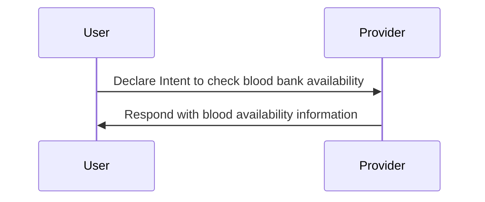
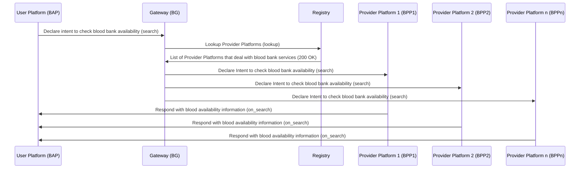
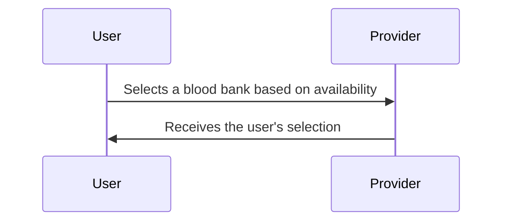
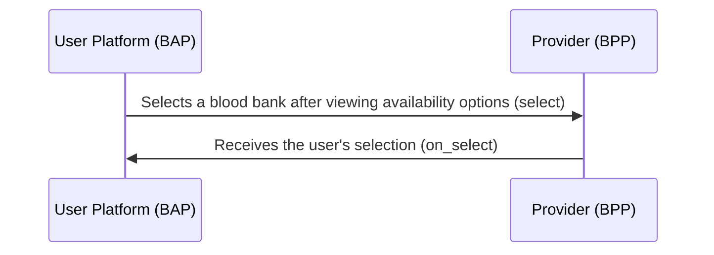
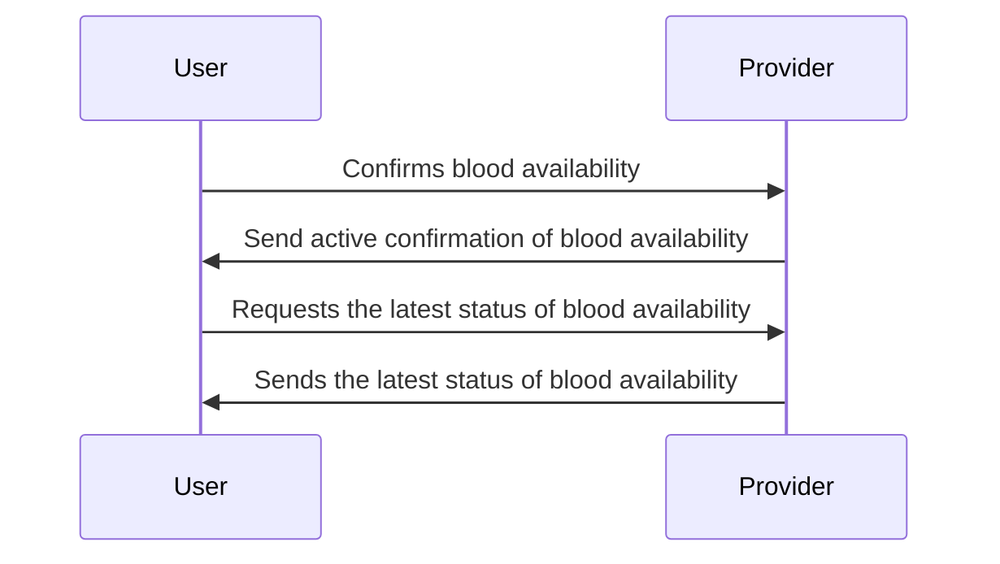
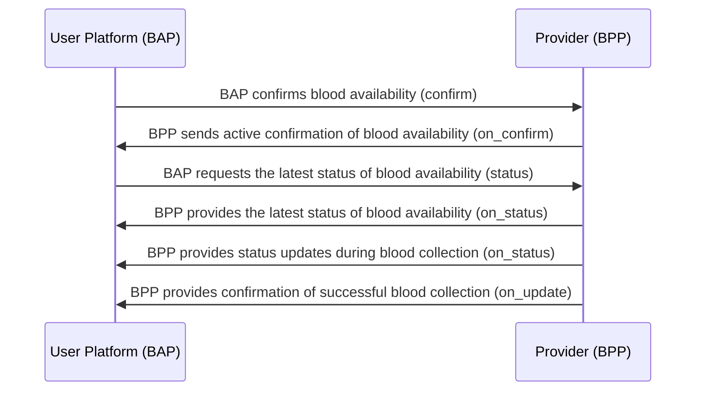

# Blood Bank Workflow

### Overview

This document outlines the workflow for checking the availability of blood from blood banks using BPP (Blood Bank Platform Provider) and BAP (Blood Bank App). The workflow includes interactions between the user (patient or their representative) and the blood bank service provider (BPP) for requesting and confirming blood availability

A typical workflow for blood bank availability consists of the following steps:

**Step 1: BAP user declares intent** \
The BAP user initiates the process by declaring their intent to check the availability of blood from a specific blood bank. The user provides details such as the type of blood needed (Eg: O+ve) and the quantity required.

**Step 2: BPP responds with blood availability** \
The BPP, the Blood Bank Platform Provider, checks the availability of the requested blood type and quantity at the specified blood bank. The BPP responds to the user with information about the availability, including the number of units available.

**Step 3: BAP user reviews and confirms** \
The BAP user reviews the availability information provided by the BPP and confirms their request if the available quantity meets their requirements.

**Step 4: BPP sends confirmation** \
Upon receiving the user's confirmation, the BPP sends a confirmation message to the user, acknowledging the request and providing any additional instructions or details.

**Step 5: BAP user acknowledges confirmation** \
The BAP user acknowledges the confirmation from the BPP, indicating their readiness to proceed with the blood collection process.

**Step 6: Blood collection and handover** \
The user proceeds to the specified blood bank location for blood collection. The blood bank staff collects the required blood units and completes the handover to the user or the designated recipient.

**Step 7: Payment and documentation** \
After the blood collection is completed, the user may need to make payment for the blood units and receive any necessary documentation or receipts from the blood bank.

**Step 8: Feedback and completion** \
The user has the option to provide feedback on the blood collection process and the quality of service received from the blood bank.

**Step 9: Service completion** \
The BPP sends service completion details to the user, including a summary of the transaction, charges incurred and any feedback provided by the user

## Search (Checking Blood Bank Availability)

### User side Actions

- A user in need of blood declares their intent to check the availability of a specific blood type at a particular blood bank. The user provides details such as the blood type (Eg: O+ve) and the quantity required (Eg: 3 units).

### Provider side Actions

- In this interaction, blood bank service providers (BPPs) respond to the user's intent by checking the availability of the requested blood type and quantity at their respective blood banks



### Beckn Protocol API Workflow

In the Beckn protocol, the user's intent to check blood bank availability (search) is published on the gateway (BG), which broadcasts the intent to multiple Blood Bank Platform Providers (BPPs). Each BPP responds with information about the availability of the requested blood type and quantity directly to the user's Blood Bank Application Platform (BAP) via asynchronous callbacks



### Example `search` request

```json
{
  "context": {
    "domain": "dhp:0.7.3",
    "location": {
      "country": {
        "code": "IND"
      }
    },
    "transaction_id": "a9aaecca-10b7-4d19-b640-b047a7c62196",
    "message_id": "$bb579fb8-cb82-4824-be12-fcbc405b6608",
    "action": "search",
    "timestamp": "2023-05-25T05:23:03.443Z",
    "version": "1.1.0",
    "bap_uri": "https://dhp-network-bap.becknprotocol.io/",
    "bap_id": "dhp-bap.becknprotocol.io",
    "ttl": "PT10M"
  },
  "message": {
    "intent": {
      "provider": {
        "descriptor": {
          "name": "Max Blood Bank"
        }
      },
      "category": {
        "id": "blood-availability"
      },
      "item": {
        "descriptor": {
          "code": "O+ve"
        },
        "quantity": {
          "available": {
            "value": "3.0",
            "unit": "unit"
          }
        }
      }
    }
  }
}
```

### Example `on_search` request

```json
{
  "context": {
    "domain": "dhp:0.7.3",
    "location": {
      "country": {
        "code": "IND"
      }
    },
    "transaction_id": "a9aaecca-10b7-4d19-b640-b047a7c62196",
    "message_id": "$bb579fb8-cb82-4824-be12-fcbc405b6608",
    "action": "on_search",
    "timestamp": "2023-05-25T05:23:03.443Z",
    "version": "1.1.0",
    "bap_uri": "https://dhp-network-bap.becknprotocol.io/",
    "bap_id": "dhp-bap.becknprotocol.io",
    "bpp_uri": "https://dhp-network-bpp.becknprotocol.io/",
    "bpp_id": "dhp-bpp.becknprotocol.io",
    "ttl": "PT10M"
  },
  "message": {
    "catalog": {
      "descriptor": {
        "name": "Available Blood Banks"
      },
      "providers": [
        {
          "id": "23847572-53a0-49f2-9159-6b89b0168f49",
          "descriptor": {
            "name": "Red Cross",
            "short_desc": "Red Cross blood bank",
            "images": [
              {
                "url": "https://redcross.in/images/logo.png"
              }
            ]
          },
          "categories": [
            {
              "id": "bb-cat01",
              "descriptor": {
                "code": "blood-bank",
                "name": "Blood Bank"
              }
            },
            {
              "id": "bb-cat02",
              "descriptor": {
                "code": "blood-camp",
                "name": "Blood Camp"
              }
            }
          ],
          "locations": [
            {
              "id": "bb-loc-01",
              "gps": "12.9164682,77.6089985"
            },
            {
              "id": "bb-loc-02",
              "gps": "12.91671,77.6092983"
            }
          ],
          "fulfillments": [
            {
              "id": "bb-ful1",
              "type": "BLOOD-BANK-SERVICE",
              "stops": [
                {
                  "type": "start",
                  "time": {
                    "timestamp": "2023-09-15T08:00:00Z"
                  }
                },
                {
                  "type": "end",
                  "time": {
                    "timestamp": "2023-09-15T18:00:00Z"
                  }
                }
              ]
            }
          ],
          "items": [
            {
              "id": "1686e805-9cae-46c0-9256-c583ac4fdb42",
              "descriptor": {
                "code": "A+ve",
                "name": "A +ve blood"
              },
              "quantity": {
                "available": {
                  "measure": {
                    "value": "100",
                    "unit": "units"
                  }
                }
              },
              "category_ids": ["bb-cat01"],
              "location_ids": ["bb-loc-01"],
              "fulfillment_ids": ["bb-ful1"]
            },
            {
              "id": "843fff06-80ed-4836-b3dc-7bb5c8e4522e",
              "descriptor": {
                "code": "B+ve",
                "name": "B +ve blood"
              },
              "quantity": {
                "available": {
                  "measure": {
                    "value": "100",
                    "unit": "units"
                  }
                }
              },
              "category_ids": ["bb-cat01"],
              "location_ids": ["bb-loc-01"],
              "fulfillment_ids": ["bb-ful1"]
            },
            {
              "id": "f8e1d8b2-779f-4106-9c83-a406ef347237",
              "descriptor": {
                "code": "A-ve",
                "name": "A -ve blood"
              },
              "quantity": {
                "available": {
                  "measure": {
                    "value": "10",
                    "unit": "units"
                  }
                }
              },
              "category_ids": ["bb-cat01"],
              "location_ids": ["bb-loc-01"],
              "fulfillment_ids": ["bb-ful1"]
            },
            {
              "id": "f47e5d7c-1e9f-414f-a9e2-9359d4434d73",
              "descriptor": {
                "code": "O+ve",
                "name": "O +ve blood"
              },
              "quantity": {
                "available": {
                  "measure": {
                    "value": "20",
                    "unit": "units"
                  }
                }
              },
              "category_ids": ["bb-cat01"],
              "location_ids": ["bb-loc-01"],
              "fulfillment_ids": ["bb-ful1"]
            }
          ]
        }
      ]
    }
  }
}
```

## Select Blood Bank Service

### User side Actions

After receiving information about blood availability from various blood bank service providers (BPPs), the user selects a blood bank that meets their requirements.

### Provider side Actions

The BPPs provide information about blood availability in response to the user's search intent. When the user selects a specific blood bank, the BPP receives the user's selection

### Logical Workflow

The logical workflow of this interaction is represented in the following sequence diagram:



### Beckn Protocol API Workflow



### Example `select` request

```json
{
  "context": {
    "domain": "dhp:0.7.3",
    "location": {
      "country": {
        "code": "IND"
      }
    },
    "transaction_id": "a9aaecca-10b7-4d19-b640-b047a7c62196",
    "message_id": "$bb579fb8-cb82-4824-be12-fcbc405b6608",
    "action": "select",
    "timestamp": "2023-05-25T05:23:03.443Z",
    "version": "1.1.0",
    "bap_uri": "https://dhp-network-bap.becknprotocol.io/",
    "bap_id": "dhp-bap.becknprotocol.io",
    "bpp_uri": "https://dhp-network-bpp.becknprotocol.io/",
    "bpp_id": "dhp-bpp.becknprotocol.io",
    "ttl": "PT10M"
  },
  "message": {
    "order": {
      "provider": {
        "id": "23847572-53a0-49f2-9159-6b89b0168f49"
      },
      "items": [
        {
          "id": "f47e5d7c-1e9f-414f-a9e2-9359d4434d73",
          "quantity": {
            "selected": {
              "measure": {
                "value": "2",
                "unit": "units"
              }
            }
          }
        }
      ]
    }
  }
}
```

### Example `on_select` request

```json
{
  "context": {
    "domain": "dhp:0.7.3",
    "location": {
      "country": {
        "code": "IND"
      }
    },
    "transaction_id": "a9aaecca-10b7-4d19-b640-b047a7c62196",
    "message_id": "$bb579fb8-cb82-4824-be12-fcbc405b6608",
    "action": "on_select",
    "timestamp": "2023-05-25T05:23:03.443Z",
    "version": "1.1.0",
    "bap_uri": "https://dhp-network-bap.becknprotocol.io/",
    "bap_id": "dhp-bap.becknprotocol.io",
    "bpp_uri": "https://dhp-network-bpp.becknprotocol.io/",
    "bpp_id": "dhp-bpp.becknprotocol.io",
    "ttl": "PT10M"
  },
  "message": {
    "order": {
      "provider": {
        "id": "23847572-53a0-49f2-9159-6b89b0168f49",
        "descriptor": {
          "name": "Red Cross",
          "short_desc": "Red Cross blood bank",
          "images": [
            {
              "url": "https://redcross.in/images/logo.png"
            }
          ]
        }
      },
      "items": [
        {
          "id": "f47e5d7c-1e9f-414f-a9e2-9359d4434d73",
          "descriptor": {
            "code": "O+ve",
            "name": "O +ve blood"
          },
          "quantity": {
            "selected": {
              "measure": {
                "value": "2",
                "unit": "units"
              }
            }
          }
        }
      ],
      "fulfillment": [
        {
          "id": "bb-ful1",
          "type": "BLOOD-BANK-SERVICE",
          "stops": [
            {
              "type": "start",
              "time": {
                "timestamp": "2023-09-15T08:00:00Z"
              }
            },
            {
              "type": "end",
              "time": {
                "timestamp": "2023-09-15T18:00:00Z"
              }
            }
          ]
        }
      ],
      "quote": {
        "price": {
          "value": "0",
          "currency": "INR"
        },
        "breakup": [
          {
            "title": "2 units of O +ve blood",
            "price": {
              "currency": "INR",
              "value": "0"
            }
          }
        ]
      }
    }
  }
}
```

## Confirm Blood Bank Service Availability

This Beckn Protocol API Workflow covers the process of confirming the availability of blood from a selected blood bank and providing status updates to the user

### User side actions

- Confirms blood availability: The user confirms the availability of blood from the selected blood bank

### Provider side actions

- Receive confirmation: The provider platform (BPP) receives the user's confirmation and processes it.
- Send active confirmation: After confirming the blood availability, the provider sends an active confirmation of the availability to the user's Beckn Application Platform (BAP).
- Provide the latest status: The provider responds to the user's request for the latest status of the blood availability. This can include information about the current quantity available and any additional details.
- Progress updates: The provider sends status updates (on_status) to the user when specific milestones are reached. For example, when the blood is prepared for collection or when it is handed over to the user.
- Course completion notification: When the blood collection process is completed, the provider sends an update (on_update) to notify the user of the successful collection.

### Logical Workflow:

The logical workflow of this interaction is represented in the following sequence diagram:



### Beckn Protocol API Workflow:

In this API workflow, the user's Beckn Application Platform (BAP) initiates the confirmation (confirm) of the blood availability from the selected blood bank. The provider's Beckn Provider Platform (BPP) responds with an active confirmation (on_confirm). Subsequently, the user can request status updates (status) and the provider sends status updates (on_status) at various stages of the blood availability process. The final step involves providing the certificate and additional status updates (on_update) upon successful blood collection



### Example `confirm` request

```json
{
  "context": {
    "domain": "dhp:0.7.3",
    "location": {
      "country": {
        "code": "IND"
      }
    },
    "transaction_id": "a9aaecca-10b7-4d19-b640-b047a7c62196",
    "message_id": "$bb579fb8-cb82-4824-be12-fcbc405b6608",
    "action": "confirm",
    "timestamp": "2023-05-25T05:23:03.443Z",
    "version": "1.1.0",
    "bap_uri": "https://dhp-network-bap.becknprotocol.io/",
    "bap_id": "dhp-bap.becknprotocol.io",
    "bpp_uri": "https://dhp-network-bpp.becknprotocol.io/",
    "bpp_id": "dhp-bpp.becknprotocol.io",
    "ttl": "PT10M"
  },
  "message": {
    "order": {
      "provider": {
        "id": "23847572-53a0-49f2-9159-6b89b0168f49"
      },
      "items": [
        {
          "id": "f47e5d7c-1e9f-414f-a9e2-9359d4434d73",
          "quantity": {
            "selected": {
              "measure": {
                "value": "2",
                "unit": "units"
              }
            }
          }
        }
      ],
      "billing": {
        "name": "Jane Doe",
        "address": "Flat 102, Serene Springs, JP Nagar, 560078",
        "email": "jane.doe@example.com",
        "phone": "+91-8888888888"
      },
      "fulfillment": {
        "customer": {
          "person": {
            "id": "patient-123",
            "name": "Jane Doe",
            "creds": [
              {
                "url": "jane.doe@example.com"
              }
            ]
          }
        }
      },
      "payments": [
        {
          "type": "PRE-FULFILLMENT",
          "status": "PAID",
          "params": {
            "amount": "0",
            "currency": "INR"
          }
        }
      ]
    }
  }
}
```

### Example `on_confirm` request

```json
{
  "context": {
    "domain": "dhp:0.7.3",
    "location": {
      "country": {
        "code": "IND"
      }
    },
    "transaction_id": "a9aaecca-10b7-4d19-b640-b047a7c62196",
    "message_id": "$bb579fb8-cb82-4824-be12-fcbc405b6608",
    "action": "on_confirm",
    "timestamp": "2023-05-25T05:23:03.443Z",
    "version": "1.1.0",
    "bap_uri": "https://dhp-network-bap.becknprotocol.io/",
    "bap_id": "dhp-bap.becknprotocol.io",
    "bpp_uri": "https://dhp-network-bpp.becknprotocol.io/",
    "bpp_id": "dhp-bpp.becknprotocol.io",
    "ttl": "PT10M"
  },
  "message": {
    "order": {
      "id": "9ff3e9f5-31f7-454e-bbed-e37e8c014404",
      "provider": {
        "id": "23847572-53a0-49f2-9159-6b89b0168f49",
        "descriptor": {
          "name": "Red Cross",
          "short_desc": "Red Cross blood bank",
          "images": [
            {
              "url": "https://redcross.in/images/logo.png"
            }
          ]
        }
      },
      "items": [
        {
          "id": "f47e5d7c-1e9f-414f-a9e2-9359d4434d73",
          "descriptor": {
            "code": "O+ve",
            "name": "O +ve blood"
          },
          "quantity": {
            "selected": {
              "measure": {
                "value": "2",
                "unit": "units"
              }
            }
          }
        }
      ],
      "fulfillment": [
        {
          "id": "bb-ful1",
          "type": "BLOOD-BANK-SERVICE",
          "customer": {
            "person": {
              "id": "donor-123",
              "name": "Jane Doe",
              "creds": [
                {
                  "url": "donor@example.com"
                }
              ]
            }
          },
          "stops": [
            {
              "type": "start",
              "time": {
                "timestamp": "2023-09-15T08:00:00Z"
              }
            },
            {
              "type": "end",
              "time": {
                "timestamp": "2023-09-15T18:00:00Z"
              }
            }
          ],
          "state": {
            "descriptor": {
              "code": "order-confirmed",
              "name": "Order has been confirmed"
            }
          }
        }
      ],
      "billing": {
        "name": "Jane Doe",
        "address": "Flat 102, Serene Springs, JP Nagar, 560078",
        "email": "jane.doe@example.com",
        "phone": "+91-8888888888"
      },
      "quote": {
        "price": {
          "value": "0",
          "currency": "INR"
        },
        "breakup": [
          {
            "title": "2 units of O +ve blood",
            "price": {
              "currency": "INR",
              "value": "0"
            }
          }
        ]
      },
      "payments": [
        {
          "type": "PRE-FULFILLMENT",
          "status": "PAID",
          "params": {
            "amount": "0",
            "currency": "INR"
          }
        }
      ]
    }
  }
}
```

### Example `status` request

```json
{
  "context": {
    "domain": "dhp:0.7.3",
    "location": {
      "country": {
        "code": "IND"
      }
    },
    "transaction_id": "a9aaecca-10b7-4d19-b640-b047a7c62196",
    "message_id": "$bb579fb8-cb82-4824-be12-fcbc405b6608",
    "action": "status",
    "timestamp": "2023-05-25T05:23:03.443Z",
    "version": "1.1.0",
    "bap_uri": "https://dhp-network-bap.becknprotocol.io/",
    "bap_id": "dhp-bap.becknprotocol.io",
    "bpp_uri": "https://dhp-network-bpp.becknprotocol.io/",
    "bpp_id": "dhp-bpp.becknprotocol.io",
    "ttl": "PT10M"
  },
  "message": {
    "order_id": "9ff3e9f5-31f7-454e-bbed-e37e8c014404"
  }
}
```

### Example `on_status` request

```json
{
  "context": {
    "domain": "dhp:0.7.3",
    "location": {
      "country": {
        "code": "IND"
      }
    },
    "transaction_id": "a9aaecca-10b7-4d19-b640-b047a7c62196",
    "message_id": "$bb579fb8-cb82-4824-be12-fcbc405b6608",
    "action": "on_status",
    "timestamp": "2023-05-25T05:23:03.443Z",
    "version": "1.1.0",
    "bap_uri": "https://dhp-network-bap.becknprotocol.io/",
    "bap_id": "dhp-bap.becknprotocol.io",
    "bpp_uri": "https://dhp-network-bpp.becknprotocol.io/",
    "bpp_id": "dhp-bpp.becknprotocol.io",
    "ttl": "PT10M"
  },
  "message": {
    "order": {
      "id": "9ff3e9f5-31f7-454e-bbed-e37e8c014404",
      "provider": {
        "id": "23847572-53a0-49f2-9159-6b89b0168f49",
        "descriptor": {
          "name": "Red Cross",
          "short_desc": "Red Cross blood bank",
          "images": [
            {
              "url": "https://redcross.in/images/logo.png"
            }
          ]
        }
      },
      "items": [
        {
          "id": "f47e5d7c-1e9f-414f-a9e2-9359d4434d73",
          "descriptor": {
            "code": "O+ve",
            "name": "O +ve blood"
          },
          "quantity": {
            "selected": {
              "measure": {
                "value": "2",
                "unit": "units"
              }
            }
          }
        }
      ],
      "fulfillment": [
        {
          "id": "bb-ful1",
          "type": "BLOOD-BANK-SERVICE",
          "customer": {
            "person": {
              "id": "donor-123",
              "name": "Jane Doe",
              "creds": [
                {
                  "url": "donor@example.com"
                }
              ]
            }
          },
          "stops": [
            {
              "type": "start",
              "time": {
                "timestamp": "2023-09-15T08:00:00Z"
              }
            },
            {
              "type": "end",
              "time": {
                "timestamp": "2023-09-15T18:00:00Z"
              }
            }
          ],
          "state": {
            "descriptor": {
              "code": "order-in-progress",
              "name": "Order is in progress"
            }
          }
        }
      ],
      "billing": {
        "name": "Jane Doe",
        "address": "Flat 102, Serene Springs, JP Nagar, 560078",
        "email": "jane.doe@example.com",
        "phone": "+91-8888888888"
      },
      "quote": {
        "price": {
          "value": "0",
          "currency": "INR"
        },
        "breakup": [
          {
            "title": "2 units of O +ve blood",
            "price": {
              "currency": "INR",
              "value": "0"
            }
          }
        ]
      },
      "payments": [
        {
          "type": "PRE-FULFILLMENT",
          "status": "PAID",
          "params": {
            "amount": "0",
            "currency": "INR"
          }
        }
      ]
    }
  }
}
```

### Example `update` request

```json
{
  "context": {
    "domain": "nic2004:85110",
    "country": "IND",
    "city": "std:080",
    "action": "update",
    "core_version": "1.1.0",
    "bap_id": "https://example-bap.com/",
    "bap_uri": "https://example-bap.com/dhp.io",
    "bpp_id": "https://bloodbank-service-provider.com",
    "bpp_uri": "https://bloodbank-service-provider.com/beckn/",
    "transaction_id": "c1a2n3u4p5d6-12345",
    "message_id": "update-fulfillment-bloodbank-1",
    "timestamp": "2023-09-09T16:00:00.052Z"
  },
  "message": {
    "update_target": "order.billing",
    "order": {
      "id": "9ff3e9f5-31f7-454e-bbed-e37e8c014404",
      "billing": {
        "name": "John Doe",
        "address": "Flat 102, Serene Springs, JP Nagar, 560078",
        "email": "john.doe@example.com",
        "phone": "+91-8888888888"
      }
    }
  }
}
```

### Example `on_update` request

```json
{
  "context": {
    "domain": "dhp:0.7.3",
    "location": {
      "country": {
        "code": "IND"
      }
    },
    "transaction_id": "a9aaecca-10b7-4d19-b640-b047a7c62196",
    "message_id": "$bb579fb8-cb82-4824-be12-fcbc405b6608",
    "action": "on_update",
    "timestamp": "2023-05-25T05:23:03.443Z",
    "version": "1.1.0",
    "bap_uri": "https://dhp-network-bap.becknprotocol.io/",
    "bap_id": "dhp-bap.becknprotocol.io",
    "bpp_uri": "https://dhp-network-bpp.becknprotocol.io/",
    "bpp_id": "dhp-bpp.becknprotocol.io",
    "ttl": "PT10M"
  },
  "message": {
    "order": {
      "id": "9ff3e9f5-31f7-454e-bbed-e37e8c014404",
      "provider": {
        "id": "23847572-53a0-49f2-9159-6b89b0168f49",
        "descriptor": {
          "name": "Red Cross",
          "short_desc": "Red Cross blood bank",
          "images": [
            {
              "url": "https://redcross.in/images/logo.png"
            }
          ]
        }
      },
      "items": [
        {
          "id": "f47e5d7c-1e9f-414f-a9e2-9359d4434d73",
          "descriptor": {
            "code": "O+ve",
            "name": "O +ve blood"
          },
          "quantity": {
            "selected": {
              "measure": {
                "value": "2",
                "unit": "units"
              }
            }
          }
        }
      ],
      "fulfillment": [
        {
          "id": "bb-ful1",
          "type": "BLOOD-BANK-SERVICE",
          "customer": {
            "person": {
              "id": "donor-123",
              "name": "Jane Doe",
              "creds": [
                {
                  "url": "donor@example.com"
                }
              ]
            }
          },
          "stops": [
            {
              "type": "start",
              "time": {
                "timestamp": "2023-09-15T08:00:00Z"
              }
            },
            {
              "type": "end",
              "time": {
                "timestamp": "2023-09-15T18:00:00Z"
              }
            }
          ],
          "state": {
            "descriptor": {
              "code": "order-updated",
              "name": "Order has been updated"
            }
          }
        }
      ],
      "billing": {
        "name": "Jane Doe",
        "address": "Flat 102, Serene Springs, JP Nagar, 560078",
        "email": "jane.doe@example.com",
        "phone": "+91-8888888888"
      },
      "quote": {
        "price": {
          "value": "0",
          "currency": "INR"
        },
        "breakup": [
          {
            "title": "2 units of O +ve blood",
            "price": {
              "currency": "INR",
              "value": "0"
            }
          }
        ]
      },
      "payments": [
        {
          "type": "PRE-FULFILLMENT",
          "status": "PAID",
          "params": {
            "amount": "0",
            "currency": "INR"
          }
        }
      ]
    }
  }
}
```

## Support for Blood Bank Services

In this stage, the user can request support related to blood bank availability and the blood bank service provider (BPP) will provide the necessary assistance

### User side actions

- Request support: The user requests support related to blood bank availability, such as clarification on availability information or assistance with the booking process

### Provider side actions

- Provide support: The provider receives the user's request for support and provides the necessary assistance or information

### Example `support` request

```json
{
  "context": {
    "domain": "dhp:0.7.3",
    "location": {
      "country": {
        "code": "IND"
      }
    },
    "transaction_id": "a9aaecca-10b7-4d19-b640-b047a7c62196",
    "message_id": "$bb579fb8-cb82-4824-be12-fcbc405b6608",
    "action": "support",
    "timestamp": "2023-05-25T05:23:03.443Z",
    "version": "1.1.0",
    "bap_uri": "https://dhp-network-bap.becknprotocol.io/",
    "bap_id": "dhp-bap.becknprotocol.io",
    "bpp_uri": "https://dhp-network-bpp.becknprotocol.io/",
    "bpp_id": "dhp-bpp.becknprotocol.io",
    "ttl": "PT10M"
  },
  "message": {
    "support": {
      "order_id": "9ff3e9f5-31f7-454e-bbed-e37e8c014404",
      "phone": "+919876543210",
      "email": "john.doe@gmail.com"
    }
  }
}
```

### Example `on_support` request

```json
{
  "context": {
    "domain": "dhp:0.7.3",
    "location": {
      "country": {
        "code": "IND"
      }
    },
    "transaction_id": "a9aaecca-10b7-4d19-b640-b047a7c62196",
    "message_id": "$bb579fb8-cb82-4824-be12-fcbc405b6608",
    "action": "on_support",
    "timestamp": "2023-05-25T05:23:03.443Z",
    "version": "1.1.0",
    "bap_uri": "https://dhp-network-bap.becknprotocol.io/",
    "bap_id": "dhp-bap.becknprotocol.io",
    "bpp_uri": "https://dhp-network-bpp.becknprotocol.io/",
    "bpp_id": "dhp-bpp.becknprotocol.io",
    "ttl": "PT10M"
  },
  "message": {
    "support": {
      "order_id": "9ff3e9f5-31f7-454e-bbed-e37e8c014404",
      "phone": "+91-9876543210",
      "email": "support@bloodbank.com",
      "url": "http://support.bloodbank.com/contact-us"
    }
  }
}
```
