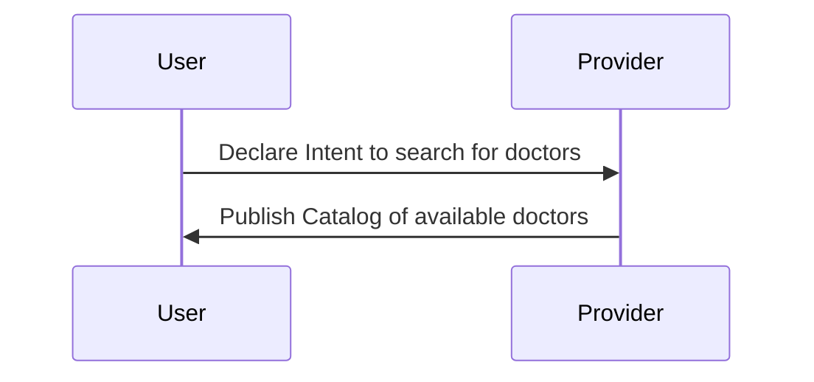
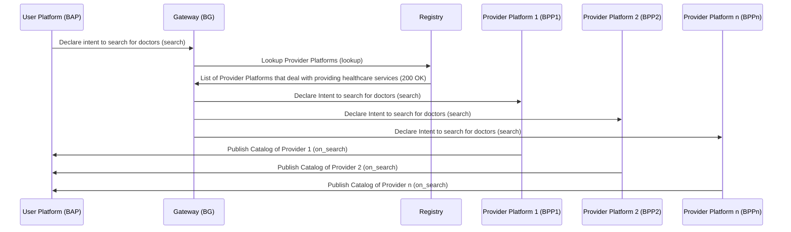
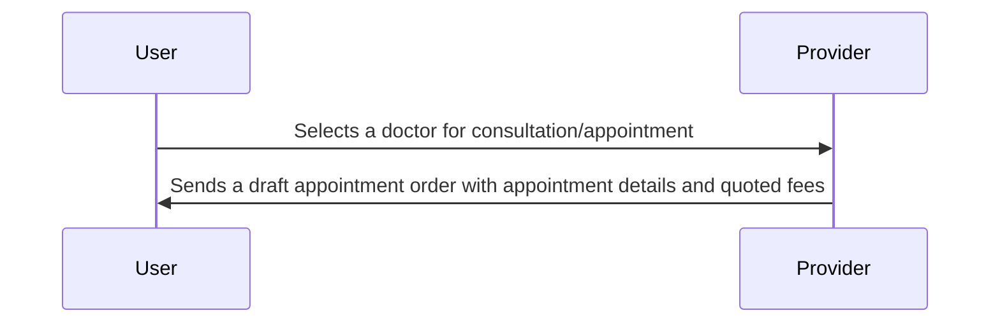
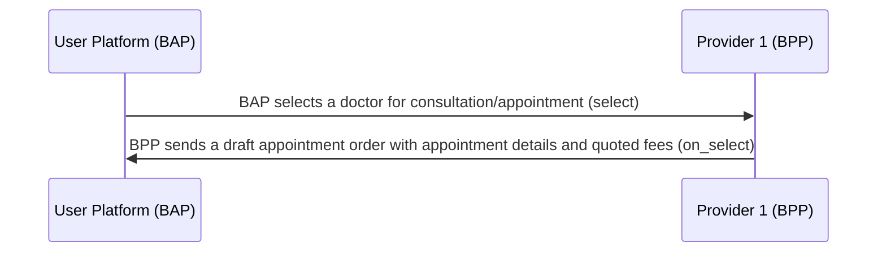
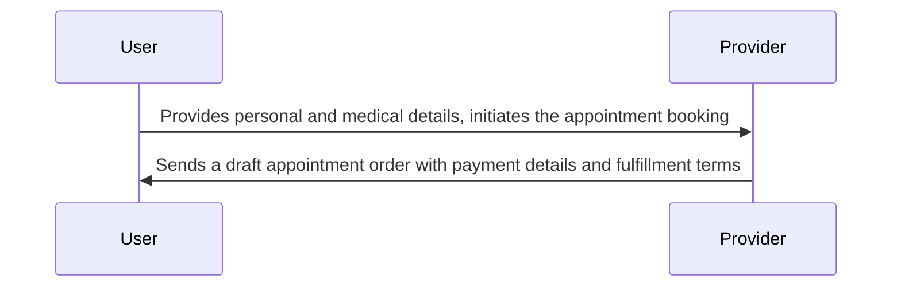
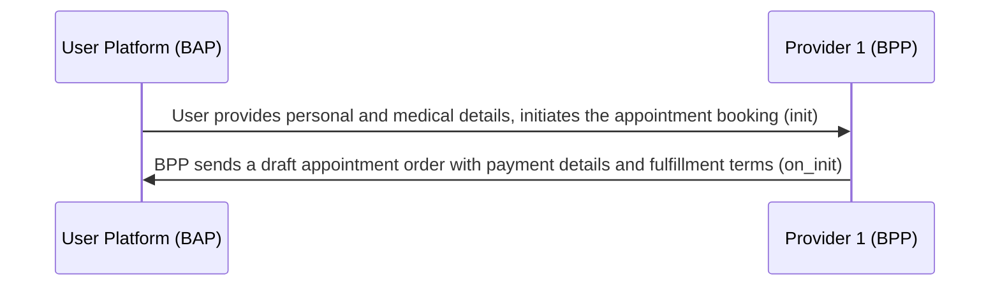
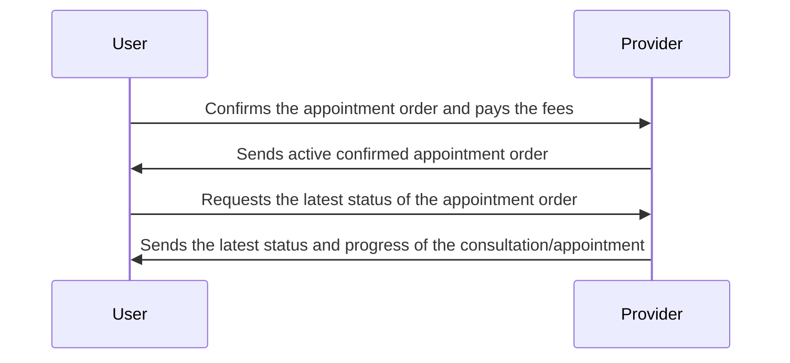
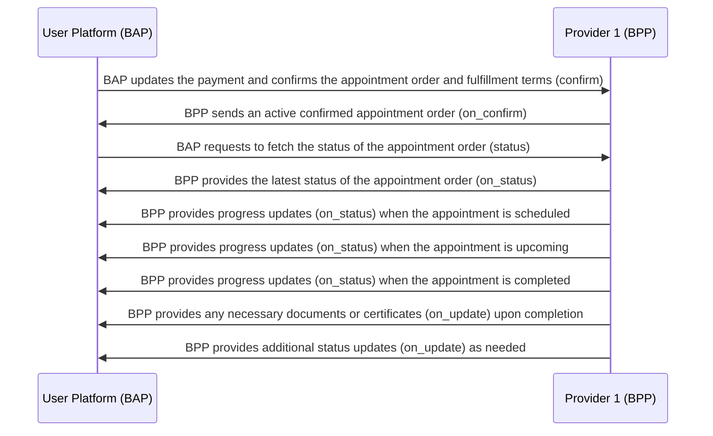

# Consultation Booking Workflow

## Overview

This document outlines the workflow for booking appointments, specifically consultations with a doctor, using BPP (Appointment Booking Platform Provider) and BAP (Appointment Booking App). The workflow includes interactions between the patient (user) and the healthcare service provider (BPP) for requesting, confirming and completing appointment bookings

A typical workflow for appointment booking consists of the following steps:

**Step 1: BAP user requests an appointment** \
The BAP user initiates the process by requesting an appointment through the BAP. The request can be made through the BAP mobile app or website, where the user provides details such as the type of consultation (Eg: cardiology), preferred date and time and any specific doctor preferences

**Step 2: BPP sends available appointment options** \
BPP, the Appointment Booking Platform Provider, retrieves a list of available appointments from various healthcare providers (BPPs) based on the user's preferences. The list includes details such as doctor availability, clinic or hospital location and cost estimates

**Step 3: BAP user selects an appointment** \
The BAP user reviews the available appointment options and selects the one that best suits their needs. They may consider factors like doctor specialization, location and appointment cost

**Step 4: BPP confirms the appointment booking** \
Upon receiving the BAP user's request and selection, the chosen BPP confirms the appointment booking. This confirmation includes information about the assigned doctor, clinic or hospital location and appointment date and time

**Step 5: BAP user provides necessary details** \
The BAP user is prompted to provide essential information, including their name, contact information and any specific medical information or concerns they want to discuss during the consultation.

**Step 6: BPP sends appointment details** \
The BPP sends the confirmed appointment details to the BAP user, including the doctor's name, clinic or hospital address and appointment date and time.

**Step 7: BAP user acknowledges the appointment** \
The BAP user acknowledges the appointment through the BAP, confirming their availability and intent to attend the consultation.

**Step 8: Appointment reminder and preparation** \
Before the appointment date, the BAP may send reminders to the user, ensuring that they are prepared for the consultation. This can include reminders to gather medical records or prepare questions for the doctor.

**Step 9: Consultation with the doctor** \
On the appointment date, the patient attends the consultation with the doctor at the designated clinic or hospital. The doctor provides medical advice and treatment as needed.

**Step 10: Post-appointment feedback and payment** \
After the consultation, the BAP user has the option to provide feedback on the consultation and make any required payments through the BAP.

**Step 11: BPP sends consultation summary** \
The BPP sends a summary of the consultation, including any medical prescriptions, to the BAP user for their records

## Search (Searching for Doctors)

The user declares the intent to search for doctors based on specialization, location and other criteria.

### User side Actions

A user seeking medical consultation can declare their intent to search for doctors in various ways, including:

- Searching for doctors based on specialization (Eg: cardiology, general physician)
- Searching for doctors based on location (Eg: within a specific radius of their current location)
- Searching for doctors based on availability (Eg: preferred date and time slots)

### Provider-side Actions

In this interaction, healthcare service providers (BPPs) publish their catalog of available doctors, categorized based on specialization and other criteria.



### Beckn Protocol API Workflow

In the Beckn protocol, the search intent generated by the Consultation Booking App (BAP) is typically published on the gateway (BG), which broadcasts the intent to multiple Healthcare Service Provider platforms (BPPs). Each of the BPPs returns their catalogs of available doctors directly to the BAP via asynchronous callbacks. The workflow for this process is illustrated below:



### Example `search` request

```json
{
  "context": {
    "domain": "dhp:0.7.3",
    "location": {
      "country": {
        "code": "IND"
      }
    },
    "transaction_id": "a9aaecca-10b7-4d19-b640-b047a7c62196",
    "message_id": "$bb579fb8-cb82-4824-be12-fcbc405b6608",
    "action": "search",
    "timestamp": "2023-05-25T05:23:03.443Z",
    "version": "1.1.0",
    "bap_uri": "https://dhp-network-bap.becknprotocol.io/",
    "bap_id": "dhp-bap.becknprotocol.io",
    "ttl": "PT10M"
  },
  "message": {
    "intent": {
      "category": {
        "descriptor": {
          "name": "cardiology"
        }
      },
      "item": {
        "descriptor": {
          "name": "consultation"
        }
      },
      "fulfillment": {
        "stops": [
          {
            "location": {
              "gps": "12.423423,77.325647",
              "radius": {
                "type": "CONSTANT",
                "value": "5",
                "unit": "km"
              }
            }
          }
        ]
      }
    }
  }
}
```

### Example `on_search` request

```json
{
  "context": {
    "domain": "dhp:0.7.3",
    "location": {
      "country": {
        "code": "IND"
      }
    },
    "transaction_id": "a9aaecca-10b7-4d19-b640-b047a7c62196",
    "message_id": "$bb579fb8-cb82-4824-be12-fcbc405b6608",
    "action": "on_search",
    "timestamp": "2023-05-25T05:23:03.443Z",
    "version": "1.1.0",
    "bap_uri": "https://dhp-network-bap.becknprotocol.io/",
    "bap_id": "dhp-bap.becknprotocol.io",
    "bpp_uri": "https://dhp-network-bpp.becknprotocol.io/",
    "bpp_id": "dhp-bpp.becknprotocol.io",
    "ttl": "PT10M"
  },
  "message": {
    "catalog": {
      "descriptor": {
        "name": "Diagnostic services"
      },
      "providers": [
        {
          "id": "289edce4-d002-4962-b311-4c025e22b4f6",
          "descriptor": {
            "name": "Max Hospitals",
            "short_desc": "Max Hospitals Pvt Ltd",
            "images": [
              {
                "url": "https://maxhospitals.in/images/logo.png"
              }
            ]
          },
          "categories": [
            {
              "id": "cat-01",
              "descriptor": {
                "code": "cardiology",
                "name": "Cardiology"
              }
            },
            {
              "id": "cat-02",
              "descriptor": {
                "code": "orthopaedic",
                "name": "Orthopaedic"
              }
            },
            {
              "id": "cat-03",
              "descriptor": {
                "code": "ent",
                "name": "ENT"
              }
            }
          ],
          "fulfillments": [
            {
              "id": "ful-01",
              "type": "OPD",
              "agent": {
                "person": {
                  "id": "1",
                  "name": "Dr Asthana",
                  "gender": "male",
                  "creds": {
                    "id": "uhiId:237402938409485039850935"
                  }
                }
              },
              "stops": [
                {
                  "type": "start",
                  "time": {
                    "timestamp": "2023-08-10T11:00:00Z"
                  }
                },
                {
                  "type": "end",
                  "time": {
                    "timestamp": "2023-08-10T11:30:00Z"
                  }
                },
                {
                  "location": {
                    "gps": "12.9164682,77.6089985"
                  }
                }
              ]
            },
            {
              "id": "ful-02",
              "type": "OPD",
              "agent": {
                "person": {
                  "id": "1",
                  "name": "Dr Asthana",
                  "gender": "male",
                  "creds": {
                    "id": "uhiId:237402938409485039850935"
                  }
                }
              },
              "stops": [
                {
                  "type": "start",
                  "time": {
                    "timestamp": "2023-08-10T09:00:00Z"
                  }
                },
                {
                  "type": "end",
                  "time": {
                    "timestamp": "2023-08-10T09:30:00Z"
                  }
                },
                {
                  "location": {
                    "gps": "12.9164682,77.6089985"
                  }
                }
              ]
            },
            {
              "id": "ful-03",
              "type": "OPD",
              "agent": {
                "person": {
                  "id": "2",
                  "name": "Dr Bhargava",
                  "gender": "female",
                  "creds": {
                    "id": "uhiId:237402938409485039850935"
                  }
                }
              },
              "stops": [
                {
                  "type": "start",
                  "time": {
                    "timestamp": "2023-08-10T11:00:00Z"
                  }
                },
                {
                  "type": "end",
                  "time": {
                    "timestamp": "2023-08-10T11:30:00Z"
                  }
                },
                {
                  "location": {
                    "gps": "12.9164682,77.6089985"
                  }
                }
              ]
            },
            {
              "id": "ful-04",
              "type": "OPD",
              "agent": {
                "person": {
                  "id": "2",
                  "name": "Dr Bhargava",
                  "gender": "female",
                  "creds": {
                    "id": "uhiId:237402938409485039850935"
                  }
                }
              },
              "stops": [
                {
                  "type": "start",
                  "time": {
                    "timestamp": "2023-08-10T10:00:00Z"
                  }
                },
                {
                  "type": "end",
                  "time": {
                    "timestamp": "2023-08-10T10:30:00Z"
                  }
                },
                {
                  "location": {
                    "gps": "12.9164682,77.6089985"
                  }
                }
              ]
            }
          ],
          "items": [
            {
              "id": "cons-01",
              "descriptor": {
                "code": "consultation",
                "name": "Consultation"
              },
              "price": {
                "value": "300",
                "currency": "INR"
              },
              "category_ids": ["cat-02"],
              "fulfillment_ids": ["ful-01"]
            },
            {
              "id": "cons-02",
              "descriptor": {
                "code": "consultation",
                "name": "Consultation"
              },
              "price": {
                "value": "300",
                "currency": "INR"
              },
              "category_ids": ["cat-02"],
              "fulfillment_ids": ["ful-02"]
            },
            {
              "id": "cons-03",
              "descriptor": {
                "code": "consultation",
                "name": "Consultation"
              },
              "price": {
                "value": "300",
                "currency": "INR"
              },
              "category_ids": ["cat-02"],
              "fulfillment_ids": ["ful-03"]
            },
            {
              "id": "cons-04",
              "descriptor": {
                "code": "consultation",
                "name": "Consultation"
              },
              "price": {
                "value": "300",
                "currency": "INR"
              },
              "category_ids": ["cat-02"],
              "fulfillment_ids": ["ful-04"]
            }
          ]
        }
      ]
    }
  }
}
```

## Select a Doctor for Booking

The user selects a doctor for consultation/appointment from the list of available doctors.

### User-side Actions

- Selecting a doctor for consultation/appointment based on preferences, such as specialization, availability and location.

### Provider-side Actions

- Receiving the user's selection of a doctor.
- Sending a draft appointment order to the user with appointment details and quoted consultation fees.

### Logical Workflow

The logical interactions between a user and a provider during the doctor selection stage are as follows:



### Beckn Protocol API Workflow



### Example `select` request

```json
{
  "context": {
    "domain": "dhp:0.7.3",
    "location": {
      "country": {
        "code": "IND"
      }
    },
    "transaction_id": "a9aaecca-10b7-4d19-b640-b047a7c62196",
    "message_id": "$bb579fb8-cb82-4824-be12-fcbc405b6608",
    "action": "select",
    "timestamp": "2023-05-25T05:23:03.443Z",
    "version": "1.1.0",
    "bap_uri": "https://dhp-network-bap.becknprotocol.io/",
    "bap_id": "dhp-bap.becknprotocol.io",
    "bpp_uri": "https://dhp-network-bpp.becknprotocol.io/",
    "bpp_id": "dhp-bpp.becknprotocol.io",
    "ttl": "PT10M"
  },
  "message": {
    "order": {
      "provider": {
        "id": "289edce4-d002-4962-b311-4c025e22b4f6"
      },
      "items": [
        {
          "id": "cons-01"
        }
      ]
    }
  }
}
```

### Example `on_select` request

```json
{
  "context": {
    "domain": "dhp:0.7.3",
    "location": {
      "country": {
        "code": "IND"
      }
    },
    "transaction_id": "a9aaecca-10b7-4d19-b640-b047a7c62196",
    "message_id": "$bb579fb8-cb82-4824-be12-fcbc405b6608",
    "action": "select",
    "timestamp": "2023-05-25T05:23:03.443Z",
    "version": "1.1.0",
    "bap_uri": "https://dhp-network-bap.becknprotocol.io/",
    "bap_id": "dhp-bap.becknprotocol.io",
    "bpp_uri": "https://dhp-network-bpp.becknprotocol.io/",
    "bpp_id": "dhp-bpp.becknprotocol.io",
    "ttl": "PT10M"
  },
  "message": {
    "order": {
      "provider": {
        "id": "289edce4-d002-4962-b311-4c025e22b4f6",
        "descriptor": {
          "name": "Max Hospitals",
          "short_desc": "Max Hospitals Pvt Ltd",
          "images": [
            {
              "url": "https://maxhospitals.in/images/logo.png"
            }
          ]
        }
      },
      "items": [
        {
          "id": "cons-01",
          "descriptor": {
            "code": "consultation",
            "name": "Consultation"
          },
          "price": {
            "value": "300",
            "currency": "INR"
          },
          "fulfillment_ids": ["ful-01"]
        }
      ],
      "fulfillments": [
        {
          "id": "ful-01",
          "type": "OPD",
          "agent": {
            "person": {
              "name": "Dr Asthana",
              "gender": "male",
              "creds": {
                "id": "uhiId:237402938409485039850935"
              }
            }
          },
          "stops": [
            {
              "type": "start",
              "time": {
                "timestamp": "2023-08-10T11:00:00Z"
              }
            },
            {
              "type": "end",
              "time": {
                "timestamp": "2023-08-10T11:30:00Z"
              }
            },
            {
              "location": {
                "gps": "12.9164682,77.6089985"
              }
            }
          ]
        }
      ],
      "quote": {
        "price": {
          "value": "300",
          "currency": "INR"
        },
        "breakup": [
          {
            "title": "General Physician Consultation",
            "price": {
              "currency": "INR",
              "value": "300"
            }
          }
        ]
      }
    }
  }
}
```

## Consultation or Appointment Order Initialization

In this stage, the user provides the required information and initiates the appointment booking.

### User-side Actions

- User provides their name, contact information and any specific medical history or requirements.
- User updates the payment details and initiates the appointment booking.

### Provider-side Actions

Request for user information, including name, contact information and medical history (if applicable)

- Receive user information and payment details.
- Send a draft appointment order with payment and fulfillment terms.

### Logical Workflow



### Beckn Protocol API Workflow



### Example `init` request

```json
{
  "context": {
    "domain": "dhp:0.7.3",
    "location": {
      "country": {
        "code": "IND"
      }
    },
    "transaction_id": "a9aaecca-10b7-4d19-b640-b047a7c62196",
    "message_id": "$bb579fb8-cb82-4824-be12-fcbc405b6608",
    "action": "init",
    "timestamp": "2023-05-25T05:23:03.443Z",
    "version": "1.1.0",
    "bap_uri": "https://dhp-network-bap.becknprotocol.io/",
    "bap_id": "dhp-bap.becknprotocol.io",
    "bpp_uri": "https://dhp-network-bpp.becknprotocol.io/",
    "bpp_id": "dhp-bpp.becknprotocol.io",
    "ttl": "PT10M"
  },
  "message": {
    "order": {
      "provider": {
        "id": "289edce4-d002-4962-b311-4c025e22b4f6"
      },
      "items": [
        {
          "id": "cons-01"
        }
      ],
      "billing": {
        "name": "Rajesh Kumar",
        "address": "Villa 5, Green Valley, Malleshwaram, 560012",
        "email": "rajesh.kumar@example.com",
        "phone": "+91-9999999999"
      },
      "fulfillments": [
        {
          "customer": {
            "person": {
              "name": "Rajesh Kumar",
              "age": "26",
              "gender": "M",
              "dob": "1995-09-11"
            }
          }
        }
      ]
    }
  }
}
```

### Example `on_init` request

```json
{
  "context": {
    "domain": "dhp:0.7.3",
    "location": {
      "country": {
        "code": "IND"
      }
    },
    "transaction_id": "a9aaecca-10b7-4d19-b640-b047a7c62196",
    "message_id": "$bb579fb8-cb82-4824-be12-fcbc405b6608",
    "action": "on_init",
    "timestamp": "2023-05-25T05:23:03.443Z",
    "version": "1.1.0",
    "bap_uri": "https://dhp-network-bap.becknprotocol.io/",
    "bap_id": "dhp-bap.becknprotocol.io",
    "bpp_uri": "https://dhp-network-bpp.becknprotocol.io/",
    "bpp_id": "dhp-bpp.becknprotocol.io",
    "ttl": "PT10M"
  },
  "message": {
    "order": {
      "provider": {
        "id": "289edce4-d002-4962-b311-4c025e22b4f6",
        "descriptor": {
          "name": "Max Hospitals",
          "short_desc": "Max Hospitals Pvt Ltd",
          "images": [
            {
              "url": "https://maxhospitals.in/images/logo.png"
            }
          ]
        }
      },
      "items": [
        {
          "id": "cons-01",
          "descriptor": {
            "code": "consultation",
            "name": "Consultation"
          },
          "price": {
            "value": "300",
            "currency": "INR"
          },
          "fulfillment_ids": ["ful-01"]
        }
      ],
      "fulfillments": [
        {
          "id": "ful-01",
          "type": "OPD",
          "customer": {
            "person": {
              "name": "Rajesh Kumar",
              "age": "26",
              "gender": "M",
              "dob": "1995-09-11"
            }
          },
          "state": {
            "descriptor": {
              "code": "slot-booked",
              "name": "Slot has been booked"
            }
          },
          "agent": {
            "person": {
              "name": "Dr Asthana",
              "gender": "male",
              "creds": {
                "id": "uhiId:237402938409485039850935"
              }
            }
          },
          "stops": [
            {
              "type": "start",
              "time": {
                "timestamp": "2023-08-10T11:00:00Z"
              }
            },
            {
              "type": "end",
              "time": {
                "timestamp": "2023-08-10T11:30:00Z"
              }
            },
            {
              "location": {
                "gps": "12.9164682,77.6089985"
              }
            }
          ]
        }
      ],
      "billing": {
        "name": "Rajesh Kumar",
        "address": "Villa 5, Green Valley, Malleshwaram, 560012",
        "email": "rajesh.kumar@example.com",
        "phone": "+91-9999999999"
      },
      "quote": {
        "price": {
          "value": "300",
          "currency": "INR"
        },
        "breakup": [
          {
            "title": "General Physician Consultation",
            "price": {
              "currency": "INR",
              "value": "300"
            }
          }
        ]
      },
      "payments": [
        {
          "type": "PRE-FULFILLMENT",
          "status": "NOT-PAID",
          "params": {
            "url": "payto://ban/98273982749428?amount=INR:300&ifsc=SBIN0000575&message=payment",
            "amount": "300",
            "currency": "INR"
          }
        }
      ]
    }
  }
}
```

## Consultation or Appointment Order Confirmation

This Beckn Protocol API Workflow covers the process of confirming a consultation or appointment booking order and providing status updates to the user.

### User-side Actions:

- Confirms the appointment order: The user confirms the consultation or appointment booking order by agreeing to the fulfillment terms and completing the payment.
- Requests the latest status: The user requests the latest status of the appointment order and the progress of the consultation or appointment.

### Provider-side Actions:

- Receive appointment order confirmation: The provider platform (BPP) receives the appointment order confirmation from the user and processes it.
- Send active confirmed appointment order: After confirming the appointment order, the provider sends an active confirmation of the order to the user's Beckn Application Platform (BAP).
- Provide the latest status: The provider responds to the user's request for the latest status of the consultation or appointment. This can include information about the appointment's current status, date, time and location.
- Progress updates: The provider sends status updates (on_status) to the user when specific milestones are reached. For example, when the appointment is scheduled, when it's upcoming and when it's completed.
- Course completion notification: When the consultation or appointment is completed, the provider sends an update (on_update) to notify the user of the service's completion and potentially provide any necessary documents or certificates.

### Logical Workflow:

The logical workflow of this interaction is represented in the following sequence diagram:



### Beckn Protocol API Workflow:

In this API workflow, the user's Beckn Application Platform (BAP) initiates the confirmation (confirm) of the consultation or appointment booking order and the provider's Beckn Provider Platform (BPP) responds with an active confirmation (on_confirm). Subsequently, the user can request status updates (status) and the provider sends status updates (on_status) at various stages of the consultation or appointment, including completion. The final step involves providing any necessary documents or certificates and additional status updates (on_update) upon completion.



### Example `confirm` request

```json
{
  "context": {
    "domain": "dhp:0.7.3",
    "location": {
      "country": {
        "code": "IND"
      }
    },
    "transaction_id": "a9aaecca-10b7-4d19-b640-b047a7c62196",
    "message_id": "$bb579fb8-cb82-4824-be12-fcbc405b6608",
    "action": "confirm",
    "timestamp": "2023-05-25T05:23:03.443Z",
    "version": "1.1.0",
    "bap_uri": "https://dhp-network-bap.becknprotocol.io/",
    "bap_id": "dhp-bap.becknprotocol.io",
    "bpp_uri": "https://dhp-network-bpp.becknprotocol.io/",
    "bpp_id": "dhp-bpp.becknprotocol.io",
    "ttl": "PT10M"
  },
  "message": {
    "order": {
      "provider": {
        "id": "289edce4-d002-4962-b311-4c025e22b4f6"
      },
      "items": [
        {
          "id": "cons-01"
        }
      ],
      "billing": {
        "name": "Rajesh Kumar",
        "address": "Villa 5, Green Valley, Malleshwaram, 560012",
        "email": "rajesh.kumar@example.com",
        "phone": "+91-9999999999"
      },
      "fulfillments": [
        {
          "customer": {
            "person": {
              "name": "Rajesh Kumar",
              "age": "26",
              "gender": "M",
              "dob": "1995-09-11"
            }
          }
        }
      ],
      "payments": [
        {
          "type": "PRE-FULFILLMENT",
          "status": "PAID",
          "params": {
            "amount": "300",
            "currency": "INR"
          }
        }
      ]
    }
  }
}
```

### Example `on_confirm` request

```json
{
  "context": {
    "domain": "dhp:0.7.3",
    "location": {
      "country": {
        "code": "IND"
      }
    },
    "transaction_id": "a9aaecca-10b7-4d19-b640-b047a7c62196",
    "message_id": "$bb579fb8-cb82-4824-be12-fcbc405b6608",
    "action": "on_confirm",
    "timestamp": "2023-05-25T05:23:03.443Z",
    "version": "1.1.0",
    "bap_uri": "https://dhp-network-bap.becknprotocol.io/",
    "bap_id": "dhp-bap.becknprotocol.io",
    "bpp_uri": "https://dhp-network-bpp.becknprotocol.io/",
    "bpp_id": "dhp-bpp.becknprotocol.io",
    "ttl": "PT10M"
  },
  "message": {
    "order": {
      "id": "759b905c-5a30-4d18-a6af-0decbac9282f",
      "provider": {
        "id": "289edce4-d002-4962-b311-4c025e22b4f6",
        "descriptor": {
          "name": "Max Hospitals",
          "short_desc": "Max Hospitals Pvt Ltd",
          "images": [
            {
              "url": "https://maxhospitals.in/images/logo.png"
            }
          ]
        }
      },
      "items": [
        {
          "id": "cons-01",
          "descriptor": {
            "code": "consultation",
            "name": "Consultation"
          },
          "price": {
            "value": "300",
            "currency": "INR"
          },
          "fulfillment_ids": ["ful-01"]
        }
      ],
      "fulfillments": [
        {
          "id": "ful-01",
          "type": "OPD",
          "customer": {
            "person": {
              "name": "Rajesh Kumar",
              "age": "26",
              "gender": "M",
              "dob": "1995-09-11"
            }
          },
          "state": {
            "descriptor": {
              "code": "slot-confirmed",
              "name": "Slot has been confirmed"
            }
          },
          "agent": {
            "person": {
              "name": "Dr Asthana",
              "gender": "male",
              "creds": {
                "id": "uhiId:237402938409485039850935"
              }
            }
          },
          "stops": [
            {
              "type": "start",
              "time": {
                "timestamp": "2023-08-10T11:00:00Z"
              }
            },
            {
              "type": "end",
              "time": {
                "timestamp": "2023-08-10T11:30:00Z"
              }
            },
            {
              "location": {
                "gps": "12.9164682,77.6089985"
              }
            }
          ]
        }
      ],
      "billing": {
        "name": "Rajesh Kumar",
        "address": "Villa 5, Green Valley, Malleshwaram, 560012",
        "email": "rajesh.kumar@example.com",
        "phone": "+91-9999999999"
      },
      "quote": {
        "price": {
          "value": "300",
          "currency": "INR"
        },
        "breakup": [
          {
            "title": "General Physician Consultation",
            "price": {
              "currency": "INR",
              "value": "300"
            }
          }
        ]
      },
      "payments": [
        {
          "type": "PRE-FULFILLMENT",
          "status": "PAID",
          "params": {
            "amount": "300",
            "currency": "INR"
          }
        }
      ]
    }
  }
}
```

### Example `status` request

```json
{
  "context": {
    "domain": "nic2004:85110",
    "action": "status",
    "version": "0.7.1",
    "bap_id": "https://healthcareconsultation-bap.com/",
    "bap_uri": "https://healthcareconsultation-bap.com/dhp.io",
    "message_id": "z1234567-a8b9-0c1d-2e3f-4g5h6i7j8k9l",
    "timestamp": "2023-09-20T12:00:00.052Z",
    "ttl": "PT5M",
    "location": {
      "city": "std:080",
      "country": "IND"
    }
  },
  "message": {
    "order_id": "759b905c-5a30-4d18-a6af-0decbac9282f"
  }
}
```

### Example `on_status` request

```json
{
  "context": {
    "domain": "dhp:0.7.3",
    "location": {
      "country": {
        "code": "IND"
      }
    },
    "transaction_id": "a9aaecca-10b7-4d19-b640-b047a7c62196",
    "message_id": "$bb579fb8-cb82-4824-be12-fcbc405b6608",
    "action": "on_status",
    "timestamp": "2023-05-25T05:23:03.443Z",
    "version": "1.1.0",
    "bap_uri": "https://dhp-network-bap.becknprotocol.io/",
    "bap_id": "dhp-bap.becknprotocol.io",
    "bpp_uri": "https://dhp-network-bpp.becknprotocol.io/",
    "bpp_id": "dhp-bpp.becknprotocol.io",
    "ttl": "PT10M"
  },
  "message": {
    "order": {
      "id": "759b905c-5a30-4d18-a6af-0decbac9282f",
      "provider": {
        "id": "289edce4-d002-4962-b311-4c025e22b4f6",
        "descriptor": {
          "name": "Max Hospitals",
          "short_desc": "Max Hospitals Pvt Ltd",
          "images": [
            {
              "url": "https://maxhospitals.in/images/logo.png"
            }
          ]
        }
      },
      "items": [
        {
          "id": "cons-01",
          "descriptor": {
            "code": "consultation",
            "name": "Consultation"
          },
          "price": {
            "value": "300",
            "currency": "INR"
          },
          "fulfillment_ids": ["ful-01"]
        }
      ],
      "fulfillments": [
        {
          "id": "ful-01",
          "type": "OPD",
          "customer": {
            "person": {
              "name": "Rajesh Kumar",
              "age": "26",
              "gender": "M",
              "dob": "1995-09-11"
            }
          },
          "state": {
            "descriptor": {
              "code": "prescription-updated",
              "name": "Prescription Updated"
            }
          },
          "agent": {
            "person": {
              "name": "Dr Asthana",
              "gender": "male",
              "creds": {
                "id": "uhiId:237402938409485039850935"
              }
            }
          },
          "stops": [
            {
              "type": "start",
              "time": {
                "timestamp": "2023-08-10T11:00:00Z"
              }
            },
            {
              "type": "end",
              "time": {
                "timestamp": "2023-08-10T11:30:00Z"
              }
            },
            {
              "location": {
                "gps": "12.9164682,77.6089985"
              }
            }
          ]
        }
      ],
      "billing": {
        "name": "Rajesh Kumar",
        "address": "Villa 5, Green Valley, Malleshwaram, 560012",
        "email": "rajesh.kumar@example.com",
        "phone": "+91-9999999999"
      },
      "quote": {
        "price": {
          "value": "300",
          "currency": "INR"
        },
        "breakup": [
          {
            "title": "General Physician Consultation",
            "price": {
              "currency": "INR",
              "value": "300"
            }
          }
        ]
      },
      "payments": [
        {
          "type": "PRE-FULFILLMENT",
          "status": "PAID",
          "params": {
            "amount": "300",
            "currency": "INR"
          }
        }
      ]
    }
  }
}
```

### Example `update` request

```json
{
  "context": {
    "domain": "nic2004:85110",
    "country": "IND",
    "city": "std:080",
    "action": "update",
    "core_version": "1.1.0",
    "bap_id": "https://example-bap.com/",
    "bap_uri": "https://example-bap.com/dhp.io",
    "bpp_id": "https://healthcare-consultation-provider.com",
    "bpp_uri": "https://healthcare-consultation-provider.com/beckn/",
    "transaction_id": "c1a2n3u4p5d6-12345",
    "message_id": "update-fulfillment-consultation-1",
    "timestamp": "2023-09-09T17:00:00.052Z"
  },
  "message": {
    "update_target": "order.billing",
    "order": {
      "id": "759b905c-5a30-4d18-a6af-0decbac9282f",
      "billing": {
        "name": "John Doe",
        "address": "Villa 5, Green Valley, Malleshwaram, 560012",
        "email": "john.doe@example.com",
        "phone": "+91-9999999999"
      }
    }
  }
}
```

### Example `on_update` request

```json
{
  "context": {
    "domain": "dhp:0.7.3",
    "location": {
      "country": {
        "code": "IND"
      }
    },
    "transaction_id": "a9aaecca-10b7-4d19-b640-b047a7c62196",
    "message_id": "$bb579fb8-cb82-4824-be12-fcbc405b6608",
    "action": "on_update",
    "timestamp": "2023-05-25T05:23:03.443Z",
    "version": "1.1.0",
    "bap_uri": "https://dhp-network-bap.becknprotocol.io/",
    "bap_id": "dhp-bap.becknprotocol.io",
    "bpp_uri": "https://dhp-network-bpp.becknprotocol.io/",
    "bpp_id": "dhp-bpp.becknprotocol.io",
    "ttl": "PT10M"
  },
  "message": {
    "order": {
      "id": "759b905c-5a30-4d18-a6af-0decbac9282f",
      "provider": {
        "id": "289edce4-d002-4962-b311-4c025e22b4f6",
        "descriptor": {
          "name": "Max Hospitals",
          "short_desc": "Max Hospitals Pvt Ltd",
          "images": [
            {
              "url": "https://maxhospitals.in/images/logo.png"
            }
          ]
        }
      },
      "items": [
        {
          "id": "cons-01",
          "descriptor": {
            "code": "consultation",
            "name": "Consultation"
          },
          "price": {
            "value": "300",
            "currency": "INR"
          },
          "fulfillment_ids": ["ful-01"]
        },
        {
          "descriptor": {
            "code": "prescription-test",
            "name": "X-Ray scan",
            "short_desc": "To check for fractures in your right knee"
          }
        },
        {
          "descriptor": {
            "code": "prescription-medication",
            "name": "Paracetamol 650mg",
            "short_desc": "1 tab X 3 times a day for 7 days"
          },
          "quantity": {
            "available": {
              "measure": {
                "value": "3",
                "unit": "units"
              }
            }
          }
        },
        {
          "descriptor": {
            "code": "prescription-medication",
            "name": "Zintac 150mg",
            "short_desc": "1 tab after dinner for 3 days"
          },
          "quantity": {
            "available": {
              "measure": {
                "value": "1",
                "unit": "units"
              }
            }
          }
        }
      ],
      "fulfillments": [
        {
          "id": "ful-01",
          "type": "OPD",
          "customer": {
            "person": {
              "name": "Rajesh Kumar",
              "age": "26",
              "gender": "M",
              "dob": "1995-09-11"
            }
          },
          "state": {
            "descriptor": {
              "code": "prescription-updated",
              "name": "The prescription information has been updated"
            }
          },
          "agent": {
            "person": {
              "name": "Dr Asthana",
              "gender": "male",
              "creds": {
                "id": "uhiId:237402938409485039850935"
              }
            }
          },
          "stops": [
            {
              "type": "start",
              "time": {
                "timestamp": "2023-08-10T11:00:00Z"
              }
            },
            {
              "type": "end",
              "time": {
                "timestamp": "2023-08-10T11:30:00Z"
              }
            },
            {
              "location": {
                "gps": "12.9164682,77.6089985"
              }
            }
          ]
        }
      ],
      "billing": {
        "name": "John Doe",
        "address": "Villa 5, Green Valley, Malleshwaram, 560012",
        "email": "john.doe@example.com",
        "phone": "+91-9999999999"
      },
      "quote": {
        "price": {
          "value": "300",
          "currency": "INR"
        },
        "breakup": [
          {
            "title": "General Physician Consultation",
            "price": {
              "currency": "INR",
              "value": "300"
            }
          }
        ]
      },
      "payments": [
        {
          "type": "PRE-FULFILLMENT",
          "status": "PAID",
          "params": {
            "amount": "300",
            "currency": "INR"
          }
        }
      ]
    }
  }
}
```

## Consultation or Appointment Support

In this stage, the user can request support for their consultation or appointment and the healthcare service provider (BPP) will provide the necessary assistance.

### User-side Actions:

- Request support: The user requests support for their consultation or appointment.

### Provider-side Actions:

- Provide support: The provider receives the user's request for support and provides the necessary assistance

### Example `support` request

```json
{
  "context": {
    "domain": "dhp:0.7.3",
    "location": {
      "country": {
        "code": "IND"
      }
    },
    "transaction_id": "a9aaecca-10b7-4d19-b640-b047a7c62196",
    "message_id": "$bb579fb8-cb82-4824-be12-fcbc405b6608",
    "action": "support",
    "timestamp": "2023-05-25T05:23:03.443Z",
    "version": "1.1.0",
    "bap_uri": "https://dhp-network-bap.becknprotocol.io/",
    "bap_id": "dhp-bap.becknprotocol.io",
    "bpp_uri": "https://dhp-network-bpp.becknprotocol.io/",
    "bpp_id": "dhp-bpp.becknprotocol.io",
    "ttl": "PT10M"
  },
  "message": {
    "support": {
      "order_id": "759b905c-5a30-4d18-a6af-0decbac9282f",
      "phone": "+919876543210",
      "email": "john.doe@gmail.com"
    }
  }
}
```

### Example `on_support` request

```json
{
  "context": {
    "domain": "dhp:0.7.3",
    "location": {
      "country": {
        "code": "IND"
      }
    },
    "transaction_id": "a9aaecca-10b7-4d19-b640-b047a7c62196",
    "message_id": "$bb579fb8-cb82-4824-be12-fcbc405b6608",
    "action": "on_support",
    "timestamp": "2023-05-25T05:23:03.443Z",
    "version": "1.1.0",
    "bap_uri": "https://dhp-network-bap.becknprotocol.io/",
    "bap_id": "dhp-bap.becknprotocol.io",
    "bpp_uri": "https://dhp-network-bpp.becknprotocol.io/",
    "bpp_id": "dhp-bpp.becknprotocol.io",
    "ttl": "PT10M"
  },
  "message": {
    "support": {
      "order_id": "759b905c-5a30-4d18-a6af-0decbac9282f",
      "phone": "1800 1080",
      "email": "customer.care@maxhospitals.com",
      "url": "https://www.maxhospitals.com/helpdesk"
    }
  }
}
```
