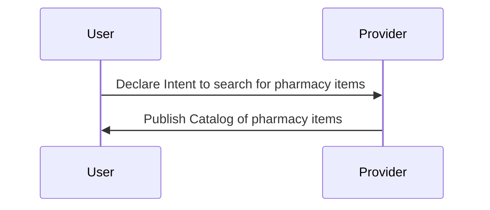
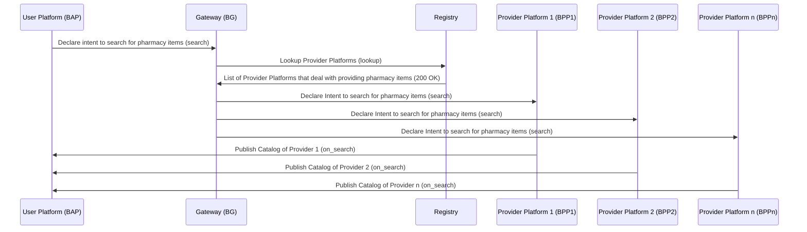
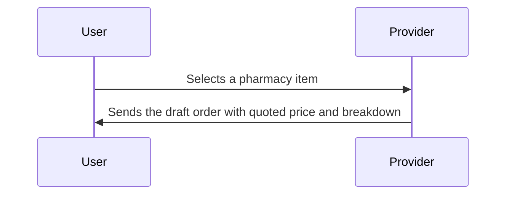
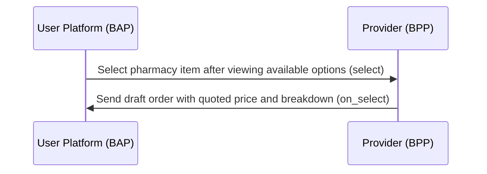
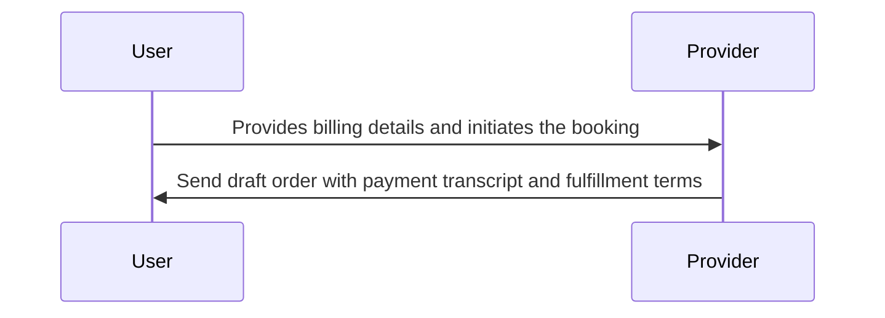
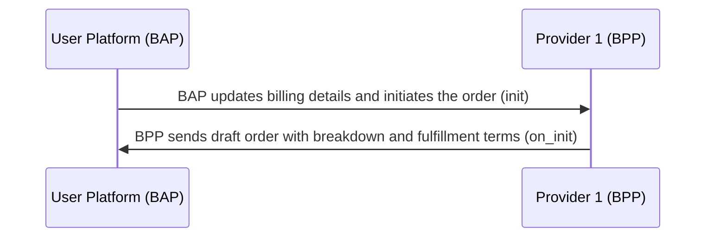
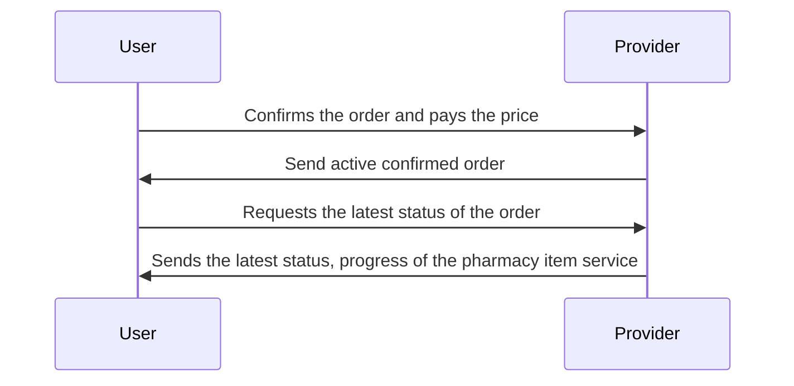
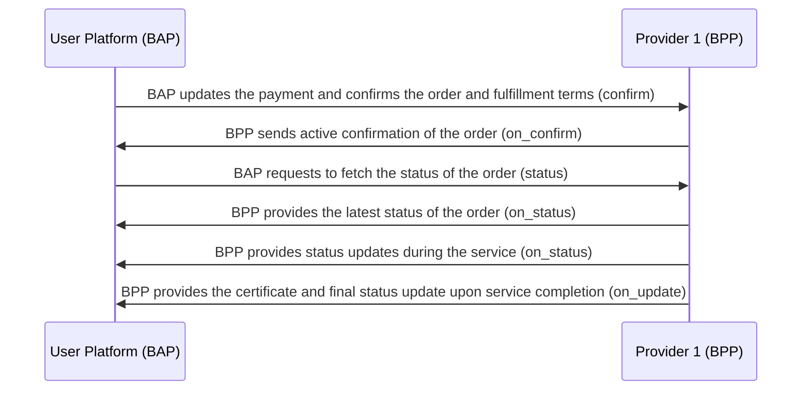

# Pharmacy Booking Workflow

### Overview

This document outlines the workflow for pharmacy item search and booking using BPP (Pharmacy Booking Platform Provider) and BAP (Pharmacy Booking App). The workflow includes interactions between the user (patient or their representative) and the pharmacy service provider (BPP) for searching and booking pharmacy items.

A typical workflow for pharmacy item booking consists of the following steps:

**Step 1: BAP user searches for pharmacy items** \
The BAP user initiates the process by searching for specific pharmacy items through the BAP. The user provides details such as the desired pharmacy location, the item they are looking for and any special requirements.

**Step 2: BPP sends available pharmacy item options** \
BPP, the Pharmacy Booking Platform Provider, retrieves a list of available pharmacy items from various pharmacy service providers (BPPs) based on the user's location and item requirements. The list includes details such as item availability, pricing and pharmacy store details.

**Step 3: BAP user selects a pharmacy item** \
The BAP user reviews the available pharmacy item options and selects the one that they want to purchase. They may consider factors like pricing and pharmacy store location.

**Step 4: BPP confirms the item booking** \
Upon receiving the BAP user's selection, the chosen BPP confirms the booking of the pharmacy item. This confirmation includes information about the selected item, pricing and pharmacy store details.

**Step 5: BAP user provides necessary details** \
The BAP user is prompted to provide essential information, including their contact details, delivery address (if applicable) and any specific instructions for the pharmacy store.

**Step 6: BPP processes the order** \
The BPP processes the confirmed pharmacy item order, including preparing the item for pickup or delivery.

**Step 7: BAP user tracks the order** \
The BAP provides a tracking feature that allows the user to monitor the status and location of their pharmacy item order in real-time.

**Step 8: BPP updates on order status** \
The BPP sends regular updates to the BAP user regarding the status of their pharmacy item order. This includes notifications for order preparation, dispatch and estimated delivery time.

**Step 9: BAP user acknowledges item receipt** \
Once the pharmacy item is received by the user (either through pickup or delivery), the BAP user acknowledges receipt through the BAP.

**Step 10: BPP completes the pharmacy item service** \
Upon successful delivery or pickup, the BPP completes the service by confirming the item's receipt or delivery to the user.

**Step 11: BAP user provides feedback and payment** \
After the service is completed, the BAP user has the option to provide feedback on the pharmacy item and make the payment through the BAP.

**Step 12: BPP sends service completion details** \
The BPP sends service completion details to the BAP user, including a summary of the transaction, any charges incurred and a receipt for payment.

## Search (Searching for Pharmacy Items)

The user declares the intent to search for pharmacy items.
Providers publish the catalog of their pharmacy items.

### User-side Actions:

A user in need of pharmacy items can declare their intent to search for specific items in various ways, including:

- Searching for pharmacy items based on the item name or category.
- Searching for pharmacy items based on location (pharmacy store).
- Searching for pharmacy items from a particular provider.
- Searching for pharmacy items with specific features or requirements.

### Provider-side Actions:

In this interaction, pharmacy service providers (BPPs) publish their catalog of pharmacy items, which are categorized based on item names, categories, availability, pricing, and pharmacy store details.



### Beckn Protocol API Workflow:

In the Beckn Protocol, the search intent generated by the Pharmacy Booking App (BAP) is typically published on the gateway (BG) that broadcasts the intent to multiple Pharmacy Service Provider platforms (BPPs). Each of the BPPs returns their catalogs of available pharmacy items directly to the BAP via asynchronous callbacks. The workflow for this process is illustrated below:



### Example `search` request

```json
{
  "context": {
    "domain": "dhp:0.7.3",
    "location": {
      "country": {
        "code": "IND"
      }
    },
    "transaction_id": "a9aaecca-10b7-4d19-b640-b047a7c62196",
    "message_id": "$bb579fb8-cb82-4824-be12-fcbc405b6608",
    "action": "search",
    "timestamp": "2023-05-25T05:23:03.443Z",
    "version": "1.1.0",
    "bap_uri": "https://dhp-network-bap.becknprotocol.io/",
    "bap_id": "dhp-bap.becknprotocol.io",
    "ttl": "PT10M"
  },
  "message": {
    "intent": {
      "category": {
        "id": "pharmacy"
      },
      "item": {
        "descriptor": {
          "name": "Dolo 650"
        }
      },
      "fulfillment": {
        "type": "IN-STORE-PICKUP",
        "stops": [
          {
            "location": {
              "gps": "12.423423,77.325647",
              "radius": {
                "type": "CONSTANT",
                "value": "5",
                "unit": "km"
              }
            }
          }
        ]
      }
    }
  }
}
```

### Example `on_search` request

```json
{
  "context": {
    "domain": "dhp:0.7.3",
    "location": {
      "country": {
        "code": "IND"
      }
    },
    "transaction_id": "a9aaecca-10b7-4d19-b640-b047a7c62196",
    "message_id": "$bb579fb8-cb82-4824-be12-fcbc405b6608",
    "action": "on_search",
    "timestamp": "2023-05-25T05:23:03.443Z",
    "version": "1.1.0",
    "bap_uri": "https://dhp-network-bap.becknprotocol.io/",
    "bap_id": "dhp-bap.becknprotocol.io",
    "bpp_uri": "https://dhp-network-bpp.becknprotocol.io/",
    "bpp_id": "dhp-bpp.becknprotocol.io",
    "ttl": "PT10M"
  },
  "message": {
    "catalog": {
      "descriptor": {
        "name": "Available Pharmacy Stores"
      },
      "providers": [
        {
          "id": "e92e7a6e-1f20-4a8d-b343-956e0d45a48c",
          "descriptor": {
            "name": "QuickPharma",
            "short_desc": "QuickPharma Pvt Ltd",
            "images": [
              {
                "url": "https://QuickPharma.in/images/logo.png"
              }
            ]
          },
          "categories": [
            {
              "id": "cat-01",
              "descriptor": {
                "code": "pharmacy",
                "name": "Pharmacy"
              }
            }
          ],
          "locations": [
            {
              "id": "phr-loc-01",
              "gps": "12.9164682,77.6089985"
            },
            {
              "id": "phr-loc-02",
              "gps": "12.91671,77.6092983"
            }
          ],
          "fulfillments": [
            {
              "id": "ful-01",
              "type": "IN-STORE-PICKUP",
              "stops": [
                {
                  "type": "start",
                  "time": {
                    "timestamp": "2023-09-15T08:00:00Z"
                  }
                },
                {
                  "type": "end",
                  "time": {
                    "timestamp": "2023-09-15T18:30:00Z"
                  }
                }
              ]
            },
            {
              "id": "ful-02",
              "type": "HOME-DELIVERY",
              "stops": [
                {
                  "type": "start",
                  "time": {
                    "timestamp": "2023-09-15T08:00:00Z"
                  }
                },
                {
                  "type": "end",
                  "time": {
                    "timestamp": "2023-09-15T18:30:00Z"
                  }
                }
              ]
            }
          ],
          "items": [
            {
              "id": "fb0999b7-7755-46d6-a2ed-b286b7c98436",
              "descriptor": {
                "code": "benadryl",
                "name": "Benadryl cough syrup"
              },
              "category_ids": ["cat-01"],
              "fulfillment_ids": ["ful-02", "ful-01"],
              "location_ids": ["phr-loc-01"],
              "price": {
                "value": "100",
                "currency": "INR"
              },
              "quantity": {
                "available": {
                  "measure": {
                    "value": "1000",
                    "unit": "units"
                  }
                },
                "maximum": {
                  "measure": {
                    "value": "5",
                    "unit": "units"
                  }
                }
              },
              "tags": [
                {
                  "descriptor": {
                    "code": "symptoms",
                    "name": "Works against these symptoms"
                  },
                  "list": [
                    {
                      "descriptor": {
                        "code": "symptom-list"
                      },
                      "value": "cough, code, nausea, headache, phelgm"
                    }
                  ]
                }
              ]
            },
            {
              "id": "1cef39d8-72d0-46f7-99ca-3f18f4bda8e3",
              "descriptor": {
                "code": "hycodan",
                "name": "Hycodan"
              },
              "category_ids": ["cat-01"],
              "fulfillment_ids": ["ful-02", "ful-01"],
              "location_ids": ["phr-loc-01"],
              "price": {
                "value": "150",
                "currency": "INR"
              },
              "quantity": {
                "available": {
                  "measure": {
                    "value": "1000",
                    "unit": "units"
                  }
                },
                "maximum": {
                  "measure": {
                    "value": "5",
                    "unit": "units"
                  }
                }
              },
              "tags": [
                {
                  "descriptor": {
                    "code": "symptoms",
                    "name": "Works against these symptoms"
                  },
                  "list": [
                    {
                      "descriptor": {
                        "code": "symptom-list"
                      },
                      "value": "cough, code, nausea, headache, phelgm"
                    }
                  ]
                }
              ]
            },
            {
              "id": "5cbc6e9d-28f4-42c7-b81e-41a336ac96ea",
              "descriptor": {
                "code": "mucinex-dm",
                "name": "Mucinex DM"
              },
              "category_ids": ["cat-01"],
              "fulfillment_ids": ["ful-02", "ful-01"],
              "location_ids": ["phr-loc-01"],
              "price": {
                "value": "180",
                "currency": "INR"
              },
              "quantity": {
                "available": {
                  "measure": {
                    "value": "1000",
                    "unit": "units"
                  }
                },
                "maximum": {
                  "measure": {
                    "value": "5",
                    "unit": "units"
                  }
                }
              },
              "tags": [
                {
                  "descriptor": {
                    "code": "symptoms",
                    "name": "Works against these symptoms"
                  },
                  "list": [
                    {
                      "descriptor": {
                        "code": "symptom-list"
                      },
                      "value": "cough, code, nausea, headache, phelgm"
                    }
                  ]
                }
              ]
            }
          ]
        }
      ]
    }
  }
}
```

## Select a Pharmacy Item for Booking

User selects a pharmacy item from the list that satisfies their requirements.
The provider sends the draft order with the interim quote to the user, along with additional details of the selected pharmacy item.

### User-side Actions:

- Selecting a pharmacy item from the available options.

### Provider-side Actions:

- Receiving the user's selection of a pharmacy item.
- Sending a draft order to the user with a quoted price and detailed information about the selected pharmacy item.

### Logical Workflow:

The logical interactions between a user and a provider during the pharmacy item selection stage are as follows:



### Beckn Protocol API Workflow:



### Example `select` request

```json
{
  "context": {
    "domain": "dhp:0.7.3",
    "location": {
      "country": {
        "code": "IND"
      }
    },
    "transaction_id": "a9aaecca-10b7-4d19-b640-b047a7c62196",
    "message_id": "$bb579fb8-cb82-4824-be12-fcbc405b6608",
    "action": "select",
    "timestamp": "2023-05-25T05:23:03.443Z",
    "version": "1.1.0",
    "bap_uri": "https://dhp-network-bap.becknprotocol.io/",
    "bap_id": "dhp-bap.becknprotocol.io",
    "bpp_uri": "https://dhp-network-bpp.becknprotocol.io/",
    "bpp_id": "dhp-bpp.becknprotocol.io",
    "ttl": "PT10M"
  },
  "message": {
    "order": {
      "provider": {
        "id": "e92e7a6e-1f20-4a8d-b343-956e0d45a48c"
      },
      "items": [
        {
          "id": "fb0999b7-7755-46d6-a2ed-b286b7c98436",
          "quantity": {
            "selected": {
              "measure": {
                "value": "2",
                "unit": "units"
              }
            }
          }
        },
        {
          "id": "1cef39d8-72d0-46f7-99ca-3f18f4bda8e3",
          "quantity": {
            "selected": {
              "measure": {
                "value": "3",
                "unit": "units"
              }
            }
          }
        }
      ],
      "fulfillments": [
        {
          "id": "ful-02"
        }
      ]
    }
  }
}
```

### Example `on_select` request

```json
{
  "context": {
    "domain": "dhp:0.7.3",
    "location": {
      "country": {
        "code": "IND"
      }
    },
    "transaction_id": "a9aaecca-10b7-4d19-b640-b047a7c62196",
    "message_id": "$bb579fb8-cb82-4824-be12-fcbc405b6608",
    "action": "on_select",
    "timestamp": "2023-05-25T05:23:03.443Z",
    "version": "1.1.0",
    "bap_uri": "https://dhp-network-bap.becknprotocol.io/",
    "bap_id": "dhp-bap.becknprotocol.io",
    "bpp_uri": "https://dhp-network-bpp.becknprotocol.io/",
    "bpp_id": "dhp-bpp.becknprotocol.io",
    "ttl": "PT10M"
  },
  "message": {
    "order": {
      "provider": {
        "id": "e92e7a6e-1f20-4a8d-b343-956e0d45a48c",
        "descriptor": {
          "name": "QuickPharma",
          "short_desc": "QuickPharma Pvt Ltd",
          "images": [
            {
              "url": "https://QuickPharma.in/images/logo.png"
            }
          ]
        }
      },
      "items": [
        {
          "id": "fb0999b7-7755-46d6-a2ed-b286b7c98436",
          "descriptor": {
            "code": "benadryl",
            "name": "Benadryl cough syrup"
          },
          "price": {
            "value": "100",
            "currency": "INR"
          },
          "quantity": {
            "selected": {
              "measure": {
                "value": "2",
                "unit": "units"
              }
            }
          }
        },
        {
          "id": "1cef39d8-72d0-46f7-99ca-3f18f4bda8e3",
          "descriptor": {
            "code": "hycodan",
            "name": "Hycodan"
          },
          "price": {
            "value": "150",
            "currency": "INR"
          },
          "quantity": {
            "selected": {
              "measure": {
                "value": "3",
                "unit": "units"
              }
            }
          }
        }
      ],
      "fulfillments": [
        {
          "id": "ful-02",
          "type": "HOME-DELIVERY",
          "stops": [
            {
              "type": "start",
              "time": {
                "timestamp": "2023-09-15T08:00:00Z"
              }
            },
            {
              "type": "end",
              "time": {
                "timestamp": "2023-09-15T18:30:00Z"
              }
            }
          ]
        }
      ],
      "quote": {
        "price": {
          "value": "650",
          "currency": "INR"
        },
        "breakup": [
          {
            "title": "Benadryl 2 units",
            "price": {
              "currency": "INR",
              "value": "200"
            }
          },
          {
            "title": "hycodan 3 units",
            "price": {
              "currency": "INR",
              "value": "450"
            }
          }
        ]
      }
    }
  }
}
```

## Order Initialization (Pharmacy Item Booking)

In this stage, the User provides the required information and initiates the booking.

### User-side Actions:

- User provides billing details (Name, Email ID, and Phone Number).
- User updates the payment details and initiates the booking.

### Provider-side Actions:

- Request for billing details.
- Receive billing details from the user.
- Send draft order with payment and fulfillment terms.

### Logical Workflow:



### Beckn Protocol API Workflow



### Example `init` request

```json
{
  "context": {
    "domain": "dhp:0.7.3",
    "location": {
      "country": {
        "code": "IND"
      }
    },
    "transaction_id": "a9aaecca-10b7-4d19-b640-b047a7c62196",
    "message_id": "$bb579fb8-cb82-4824-be12-fcbc405b6608",
    "action": "init",
    "timestamp": "2023-05-25T05:23:03.443Z",
    "version": "1.1.0",
    "bap_uri": "https://dhp-network-bap.becknprotocol.io/",
    "bap_id": "dhp-bap.becknprotocol.io",
    "bpp_uri": "https://dhp-network-bpp.becknprotocol.io/",
    "bpp_id": "dhp-bpp.becknprotocol.io",
    "ttl": "PT10M"
  },
  "message": {
    "order": {
      "provider": {
        "id": "e92e7a6e-1f20-4a8d-b343-956e0d45a48c"
      },
      "items": [
        {
          "id": "fb0999b7-7755-46d6-a2ed-b286b7c98436",
          "quantity": {
            "selected": {
              "measure": {
                "value": "2",
                "unit": "units"
              }
            }
          }
        },
        {
          "id": "1cef39d8-72d0-46f7-99ca-3f18f4bda8e3",
          "quantity": {
            "selected": {
              "measure": {
                "value": "3",
                "unit": "units"
              }
            }
          }
        }
      ],
      "fulfillments": [
        {
          "id": "ful-02",
          "stops": [
            {
              "type": "START",
              "location": {
                "gps": "12.423423,77.325647"
              }
            },
            {
              "type": "END",
              "location": {
                "gps": "12.423483,77.325697"
              }
            }
          ]
        }
      ],
      "billing": {
        "name": "Alice Smith",
        "address": "Apt 303, Maple Towers, Richmond Road, 560001",
        "email": "alice.smith@example.com",
        "phone": "+91-7777777777"
      }
    }
  }
}
```

### Example `on_init` request

```json
{
  "context": {
    "domain": "dhp:0.7.3",
    "location": {
      "country": {
        "code": "IND"
      }
    },
    "transaction_id": "a9aaecca-10b7-4d19-b640-b047a7c62196",
    "message_id": "$bb579fb8-cb82-4824-be12-fcbc405b6608",
    "action": "on_init",
    "timestamp": "2023-05-25T05:23:03.443Z",
    "version": "1.1.0",
    "bap_uri": "https://dhp-network-bap.becknprotocol.io/",
    "bap_id": "dhp-bap.becknprotocol.io",
    "bpp_uri": "https://dhp-network-bpp.becknprotocol.io/",
    "bpp_id": "dhp-bpp.becknprotocol.io",
    "ttl": "PT10M"
  },
  "message": {
    "order": {
      "provider": {
        "id": "e92e7a6e-1f20-4a8d-b343-956e0d45a48c",
        "descriptor": {
          "name": "QuickPharma",
          "short_desc": "QuickPharma Pvt Ltd",
          "images": [
            {
              "url": "https://quickPharma.in/images/logo.png"
            }
          ]
        }
      },
      "items": [
        {
          "id": "fb0999b7-7755-46d6-a2ed-b286b7c98436",
          "descriptor": {
            "code": "benadryl",
            "name": "Benadryl cough syrup"
          },
          "price": {
            "value": "100",
            "currency": "INR"
          },
          "quantity": {
            "selected": {
              "measure": {
                "value": "2",
                "unit": "units"
              }
            }
          }
        },
        {
          "id": "1cef39d8-72d0-46f7-99ca-3f18f4bda8e3",
          "descriptor": {
            "code": "hycodan",
            "name": "Hycodan"
          },
          "price": {
            "value": "150",
            "currency": "INR"
          },
          "quantity": {
            "selected": {
              "measure": {
                "value": "3",
                "unit": "units"
              }
            }
          }
        }
      ],
      "fulfillments": [
        {
          "id": "ful-02",
          "type": "HOME-DELIVERY",
          "stops": [
            {
              "type": "start",
              "time": {
                "timestamp": "2023-09-15T08:00:00Z"
              },
              "location": {
                "gps": "12.423423,77.325647"
              }
            },
            {
              "type": "end",
              "time": {
                "timestamp": "2023-09-15T18:30:00Z"
              },
              "location": {
                "gps": "12.423483,77.325697"
              }
            }
          ],
          "state": {
            "descriptor": {
              "code": "order-initiated",
              "name": "Order has been initiated"
            }
          }
        }
      ],
      "quote": {
        "price": {
          "value": "700",
          "currency": "INR"
        },
        "breakup": [
          {
            "title": "Benadryl 2 units",
            "price": {
              "currency": "INR",
              "value": "200"
            }
          },
          {
            "title": "hycodan 3 units",
            "price": {
              "currency": "INR",
              "value": "450"
            }
          },
          {
            "title": "delivery charge",
            "price": {
              "currency": "INR",
              "value": "50"
            }
          }
        ]
      },
      "billing": {
        "name": "Alice Smith",
        "address": "Apt 303, Maple Towers, Richmond Road, 560001",
        "email": "alice.smith@example.com",
        "phone": "+91-7777777777"
      },
      "payments": [
        {
          "type": "PRE-FULFILLMENT",
          "status": "NOT-PAID",
          "params": {
            "url": "payto://ban/1234567890?amount=INR:700&ifsc=ABCD0000123&message=medicine-payment",
            "amount": "700",
            "currency": "INR"
          }
        }
      ],
      "cancellation_terms": [
        {
          "fulfillment_state": {
            "descriptor": {
              "code": "in-progress"
            }
          },
          "cancellation_fee": {
            "percentage": "30%"
          },
          "external_ref": {
            "mimetype": "text/html",
            "url": "https://quickPharma.in/charge/tnc.html"
          }
        }
      ]
    }
  }
}
```

## Pharmacy Item Booking Order Confirmation

This Beckn Protocol API Workflow covers the process of confirming a pharmacy item booking order and providing status updates to the user.

### User-side Actions:

- Confirms the order: The user confirms the pharmacy item booking order by agreeing to the fulfillment terms and completing the payment.
- Requests the latest status: The user requests the latest status of the order and the progress of the pharmacy item service.

### Provider-side Actions:

- Receive order confirmation: The provider platform (BPP) receives the order confirmation from the user and processes it.
- Send active confirmed order: After confirming the order, the provider sends an active confirmation of the order to the user's Beckn Application Platform (BAP).
- Provide the latest status: The provider responds to the user's request for the latest status of the pharmacy item service. This can include information about the service's current status, location, estimated delivery time, and other relevant details.
- Progress updates: The provider sends status updates (on_status) to the user when specific milestones are reached. For example, when the pharmacy item is prepared for dispatch or when it is out for delivery.
- Completion notification: When the pharmacy item service is completed (item delivered or ready for pickup), the provider sends an update (on_update) to notify the user of the service's completion and provide any necessary documents or certificates.

### Logical Workflow:

The logical workflow of this interaction is represented in the following sequence diagram:



### Beckn Protocol API Workflow:

In this API workflow, the user's Beckn Application Platform (BAP) initiates the confirmation (confirm) of the pharmacy item booking order, and the provider's Beckn Provider Platform (BPP) responds with an active confirmation (on_confirm). Subsequently, the user can request status updates (status), and the provider sends status updates (on_status) at various stages of the pharmacy item service, including completion. The final step involves providing the certificate and additional status updates (on_update) upon service completion.



### Example `confirm` request

```json
{
  "context": {
    "domain": "dhp:0.7.3",
    "location": {
      "country": {
        "code": "IND"
      }
    },
    "transaction_id": "a9aaecca-10b7-4d19-b640-b047a7c62196",
    "message_id": "$bb579fb8-cb82-4824-be12-fcbc405b6608",
    "action": "confirm",
    "timestamp": "2023-05-25T05:23:03.443Z",
    "version": "1.1.0",
    "bap_uri": "https://dhp-network-bap.becknprotocol.io/",
    "bap_id": "dhp-bap.becknprotocol.io",
    "bpp_uri": "https://dhp-network-bpp.becknprotocol.io/",
    "bpp_id": "dhp-bpp.becknprotocol.io",
    "ttl": "PT10M"
  },
  "message": {
    "order": {
      "provider": {
        "id": "e92e7a6e-1f20-4a8d-b343-956e0d45a48c"
      },
      "items": [
        {
          "id": "fb0999b7-7755-46d6-a2ed-b286b7c98436",
          "quantity": {
            "selected": {
              "measure": {
                "value": "2",
                "unit": "units"
              }
            }
          }
        }
      ],
      "fulfillments": [
        {
          "id": "ful-02",
          "stops": [
            {
              "type": "START",
              "location": {
                "gps": "12.423423,77.325647"
              }
            },
            {
              "type": "END",
              "location": {
                "gps": "12.423483,77.325697"
              }
            }
          ]
        }
      ],
      "billing": {
        "name": "Alice Smith",
        "address": "Apt 303, Maple Towers, Richmond Road, 560001",
        "email": "alice.smith@example.com",
        "phone": "+91-7777777777"
      },
      "payments": [
        {
          "type": "PRE-FULFILLMENT",
          "status": "PAID",
          "params": {
            "amount": "250",
            "currency": "INR"
          }
        }
      ]
    }
  }
}
```

### Example `on_confirm` request

```json
{
  "context": {
    "domain": "dhp:0.7.3",
    "location": {
      "country": {
        "code": "IND"
      }
    },
    "transaction_id": "a9aaecca-10b7-4d19-b640-b047a7c62196",
    "message_id": "$bb579fb8-cb82-4824-be12-fcbc405b6608",
    "action": "on_confirm",
    "timestamp": "2023-05-25T05:23:03.443Z",
    "version": "1.1.0",
    "bap_uri": "https://dhp-network-bap.becknprotocol.io/",
    "bap_id": "dhp-bap.becknprotocol.io",
    "bpp_uri": "https://dhp-network-bpp.becknprotocol.io/",
    "bpp_id": "dhp-bpp.becknprotocol.io",
    "ttl": "PT10M"
  },
  "message": {
    "order": {
      "id": "853c7593-f4bf-4557-8832-118a591787ba",
      "provider": {
        "id": "e92e7a6e-1f20-4a8d-b343-956e0d45a48c",
        "descriptor": {
          "name": "QuickPharma",
          "short_desc": "QuickPharma Pvt Ltd",
          "images": [
            {
              "url": "https://quickPharma.in/images/logo.png"
            }
          ]
        }
      },
      "items": [
        {
          "id": "fb0999b7-7755-46d6-a2ed-b286b7c98436",
          "descriptor": {
            "code": "benadryl",
            "name": "Benadryl cough syrup"
          },
          "price": {
            "value": "100",
            "currency": "INR"
          },
          "quantity": {
            "selected": {
              "measure": {
                "value": "2",
                "unit": "units"
              }
            }
          }
        },
        {
          "id": "1cef39d8-72d0-46f7-99ca-3f18f4bda8e3",
          "descriptor": {
            "code": "hycodan",
            "name": "Hycodan"
          },
          "price": {
            "value": "150",
            "currency": "INR"
          },
          "quantity": {
            "selected": {
              "measure": {
                "value": "3",
                "unit": "units"
              }
            }
          }
        }
      ],
      "fulfillments": [
        {
          "id": "ful-02",
          "type": "HOME-DELIVERY",
          "stops": [
            {
              "type": "start",
              "time": {
                "timestamp": "2023-09-15T08:00:00Z"
              },
              "location": {
                "gps": "12.423423,77.325647"
              }
            },
            {
              "type": "end",
              "time": {
                "timestamp": "2023-09-15T18:30:00Z"
              },
              "location": {
                "gps": "12.423483,77.325697"
              }
            }
          ],
          "state": {
            "descriptor": {
              "code": "order-confirm",
              "name": "Order has been confirmed"
            }
          }
        }
      ],
      "quote": {
        "price": {
          "value": "700",
          "currency": "INR"
        },
        "breakup": [
          {
            "title": "Benadryl 2 units",
            "price": {
              "currency": "INR",
              "value": "200"
            }
          },
          {
            "title": "hycodan 3 units",
            "price": {
              "currency": "INR",
              "value": "450"
            }
          },
          {
            "title": "delivery charge",
            "price": {
              "currency": "INR",
              "value": "50"
            }
          }
        ]
      },
      "billing": {
        "name": "Alice Smith",
        "address": "Apt 303, Maple Towers, Richmond Road, 560001",
        "email": "alice.smith@example.com",
        "phone": "+91-7777777777"
      },
      "payments": [
        {
          "type": "PRE-FULFILLMENT",
          "status": "PAID",
          "params": {
            "amount": "700",
            "currency": "INR"
          }
        }
      ],
      "cancellation_terms": [
        {
          "fulfillment_state": {
            "descriptor": {
              "code": "in-progress"
            }
          },
          "cancellation_fee": {
            "percentage": "30%"
          },
          "external_ref": {
            "mimetype": "text/html",
            "url": "https://quickPharma.in/charge/tnc.html"
          }
        }
      ]
    }
  }
}
```

### Example `status` request

```json
{
  "context": {
    "domain": "dhp:0.7.3",
    "location": {
      "country": {
        "code": "IND"
      }
    },
    "transaction_id": "a9aaecca-10b7-4d19-b640-b047a7c62196",
    "message_id": "$bb579fb8-cb82-4824-be12-fcbc405b6608",
    "action": "status",
    "timestamp": "2023-05-25T05:23:03.443Z",
    "version": "1.1.0",
    "bap_uri": "https://dhp-network-bap.becknprotocol.io/",
    "bap_id": "dhp-bap.becknprotocol.io",
    "bpp_uri": "https://dhp-network-bpp.becknprotocol.io/",
    "bpp_id": "dhp-bpp.becknprotocol.io",
    "ttl": "PT10M"
  },
  "message": {
    "order_id": "853c7593-f4bf-4557-8832-118a591787ba"
  }
}
```

### Example `on_status` request (Item packed)

```json
{
  "context": {
    "domain": "dhp:0.7.3",
    "location": {
      "country": {
        "code": "IND"
      }
    },
    "transaction_id": "a9aaecca-10b7-4d19-b640-b047a7c62196",
    "message_id": "$bb579fb8-cb82-4824-be12-fcbc405b6608",
    "action": "on_status",
    "timestamp": "2023-05-25T05:23:03.443Z",
    "version": "1.1.0",
    "bap_uri": "https://dhp-network-bap.becknprotocol.io/",
    "bap_id": "dhp-bap.becknprotocol.io",
    "bpp_uri": "https://dhp-network-bpp.becknprotocol.io/",
    "bpp_id": "dhp-bpp.becknprotocol.io",
    "ttl": "PT10M"
  },
  "message": {
    "order": {
      "id": "853c7593-f4bf-4557-8832-118a591787ba",
      "provider": {
        "id": "e92e7a6e-1f20-4a8d-b343-956e0d45a48c",
        "descriptor": {
          "name": "QuickPharma",
          "short_desc": "QuickPharma Pvt Ltd",
          "images": [
            {
              "url": "https://quickPharma.in/images/logo.png"
            }
          ]
        }
      },
      "items": [
        {
          "id": "fb0999b7-7755-46d6-a2ed-b286b7c98436",
          "descriptor": {
            "code": "benadryl",
            "name": "Benadryl cough syrup"
          },
          "price": {
            "value": "100",
            "currency": "INR"
          },
          "quantity": {
            "selected": {
              "measure": {
                "value": "2",
                "unit": "units"
              }
            }
          }
        },
        {
          "id": "1cef39d8-72d0-46f7-99ca-3f18f4bda8e3",
          "descriptor": {
            "code": "hycodan",
            "name": "Hycodan"
          },
          "price": {
            "value": "150",
            "currency": "INR"
          },
          "quantity": {
            "selected": {
              "measure": {
                "value": "3",
                "unit": "units"
              }
            }
          }
        }
      ],
      "fulfillments": [
        {
          "id": "ful-02",
          "type": "HOME-DELIVERY",
          "stops": [
            {
              "type": "start",
              "time": {
                "timestamp": "2023-09-15T08:00:00Z"
              },
              "location": {
                "gps": "12.423423,77.325647"
              }
            },
            {
              "type": "end",
              "time": {
                "timestamp": "2023-09-15T18:30:00Z"
              },
              "location": {
                "gps": "12.423483,77.325697"
              }
            }
          ],
          "state": {
            "descriptor": {
              "code": "order-packed",
              "name": "Order has been packed and can be picked up from the store"
            }
          }
        }
      ],
      "quote": {
        "price": {
          "value": "700",
          "currency": "INR"
        },
        "breakup": [
          {
            "title": "Benadryl 2 units",
            "price": {
              "currency": "INR",
              "value": "200"
            }
          },
          {
            "title": "hycodan 3 units",
            "price": {
              "currency": "INR",
              "value": "450"
            }
          },
          {
            "title": "delivery charge",
            "price": {
              "currency": "INR",
              "value": "50"
            }
          }
        ]
      },
      "billing": {
        "name": "Alice Smith",
        "address": "Apt 303, Maple Towers, Richmond Road, 560001",
        "email": "alice.smith@example.com",
        "phone": "+91-7777777777"
      },
      "payments": [
        {
          "type": "PRE-FULFILLMENT",
          "status": "PAID",
          "params": {
            "amount": "700",
            "currency": "INR"
          }
        }
      ],
      "cancellation_terms": [
        {
          "fulfillment_state": {
            "descriptor": {
              "code": "in-progress"
            }
          },
          "cancellation_fee": {
            "percentage": "30%"
          },
          "external_ref": {
            "mimetype": "text/html",
            "url": "https://quickPharma.in/charge/tnc.html"
          }
        }
      ]
    }
  }
}
```

### Example `on_status` request (Order complete)

```json
{
  "context": {
    "domain": "dhp:0.7.3",
    "location": {
      "country": {
        "code": "IND"
      }
    },
    "transaction_id": "a9aaecca-10b7-4d19-b640-b047a7c62196",
    "message_id": "$bb579fb8-cb82-4824-be12-fcbc405b6608",
    "action": "on_status",
    "timestamp": "2023-05-25T05:23:03.443Z",
    "version": "1.1.0",
    "bap_uri": "https://dhp-network-bap.becknprotocol.io/",
    "bap_id": "dhp-bap.becknprotocol.io",
    "bpp_uri": "https://dhp-network-bpp.becknprotocol.io/",
    "bpp_id": "dhp-bpp.becknprotocol.io",
    "ttl": "PT10M"
  },
  "message": {
    "order": {
      "id": "853c7593-f4bf-4557-8832-118a591787ba",
      "provider": {
        "id": "e92e7a6e-1f20-4a8d-b343-956e0d45a48c",
        "descriptor": {
          "name": "QuickPharma",
          "short_desc": "QuickPharma Pvt Ltd",
          "images": [
            {
              "url": "https://quickPharma.in/images/logo.png"
            }
          ]
        }
      },
      "items": [
        {
          "id": "fb0999b7-7755-46d6-a2ed-b286b7c98436",
          "descriptor": {
            "code": "benadryl",
            "name": "Benadryl cough syrup"
          },
          "price": {
            "value": "100",
            "currency": "INR"
          },
          "quantity": {
            "selected": {
              "measure": {
                "value": "2",
                "unit": "units"
              }
            }
          }
        },
        {
          "id": "1cef39d8-72d0-46f7-99ca-3f18f4bda8e3",
          "descriptor": {
            "code": "hycodan",
            "name": "Hycodan"
          },
          "price": {
            "value": "150",
            "currency": "INR"
          },
          "quantity": {
            "selected": {
              "measure": {
                "value": "3",
                "unit": "units"
              }
            }
          }
        }
      ],
      "fulfillments": [
        {
          "id": "ful-02",
          "type": "HOME-DELIVERY",
          "stops": [
            {
              "type": "start",
              "time": {
                "timestamp": "2023-09-15T08:00:00Z"
              },
              "location": {
                "gps": "12.423423,77.325647"
              }
            },
            {
              "type": "end",
              "time": {
                "timestamp": "2023-09-15T18:30:00Z"
              },
              "location": {
                "gps": "12.423483,77.325697"
              }
            }
          ],
          "state": {
            "descriptor": {
              "code": "order-delivered",
              "name": "Order has been delivered"
            }
          }
        }
      ],
      "quote": {
        "price": {
          "value": "700",
          "currency": "INR"
        },
        "breakup": [
          {
            "title": "Benadryl 2 units",
            "price": {
              "currency": "INR",
              "value": "200"
            }
          },
          {
            "title": "hycodan 3 units",
            "price": {
              "currency": "INR",
              "value": "450"
            }
          },
          {
            "title": "delivery charge",
            "price": {
              "currency": "INR",
              "value": "50"
            }
          }
        ]
      },
      "billing": {
        "name": "Alice Smith",
        "address": "Apt 303, Maple Towers, Richmond Road, 560001",
        "email": "alice.smith@example.com",
        "phone": "+91-7777777777"
      },
      "payments": [
        {
          "type": "PRE-FULFILLMENT",
          "status": "PAID",
          "params": {
            "amount": "700",
            "currency": "INR"
          }
        }
      ],
      "cancellation_terms": [
        {
          "fulfillment_state": {
            "descriptor": {
              "code": "in-progress"
            }
          },
          "cancellation_fee": {
            "percentage": "30%"
          },
          "external_ref": {
            "mimetype": "text/html",
            "url": "https://quickPharma.in/charge/tnc.html"
          }
        }
      ]
    }
  }
}
```

### Example `update` request

```json
{
  "context": {
    "domain": "nic2004:85110",
    "country": "IND",
    "city": "std:080",
    "action": "update",
    "core_version": "1.1.0",
    "bap_id": "https://example-bap.com/",
    "bap_uri": "https://example-bap.com/dhp.io",
    "bpp_id": "https://pharmacy-service-provider.com",
    "bpp_uri": "https://pharmacy-service-provider.com/beckn/",
    "transaction_id": "c1a2n3u4p5d6-12345",
    "message_id": "update-fulfillment-pharmacy-1",
    "timestamp": "2023-09-09T19:00:00.052Z"
  },
  "message": {
    "update_target": "order.fulfillments[0].stops[0]",
    "order": {
      "id": "853c7593-f4bf-4557-8832-118a591787ba",
      "fulfillments": [
        {
          "id": "ful-02",
          "stops": [
            {
              "type": "START",
              "location": {
                "gps": "12.423423,77.325647"
              }
            },
            {
              "type": "END",
              "location": {
                "gps": "12.423483,77.325797"
              }
            }
          ]
        }
      ]
    }
  }
}
```

### Example `on_update` request

```json
{
  "context": {
    "domain": "dhp:0.7.3",
    "location": {
      "country": {
        "code": "IND"
      }
    },
    "transaction_id": "a9aaecca-10b7-4d19-b640-b047a7c62196",
    "message_id": "$bb579fb8-cb82-4824-be12-fcbc405b6608",
    "action": "on_update",
    "timestamp": "2023-05-25T05:23:03.443Z",
    "version": "1.1.0",
    "bap_uri": "https://dhp-network-bap.becknprotocol.io/",
    "bap_id": "dhp-bap.becknprotocol.io",
    "bpp_uri": "https://dhp-network-bpp.becknprotocol.io/",
    "bpp_id": "dhp-bpp.becknprotocol.io",
    "ttl": "PT10M"
  },
  "message": {
    "order": {
      "id": "853c7593-f4bf-4557-8832-118a591787ba",
      "provider": {
        "id": "e92e7a6e-1f20-4a8d-b343-956e0d45a48c",
        "descriptor": {
          "name": "QuickPharma",
          "short_desc": "QuickPharma Pvt Ltd",
          "images": [
            {
              "url": "https://quickPharma.in/images/logo.png"
            }
          ]
        }
      },
      "items": [
        {
          "id": "fb0999b7-7755-46d6-a2ed-b286b7c98436",
          "descriptor": {
            "code": "benadryl",
            "name": "Benadryl cough syrup"
          },
          "price": {
            "value": "100",
            "currency": "INR"
          },
          "quantity": {
            "selected": {
              "measure": {
                "value": "2",
                "unit": "units"
              }
            }
          }
        },
        {
          "id": "1cef39d8-72d0-46f7-99ca-3f18f4bda8e3",
          "descriptor": {
            "code": "hycodan",
            "name": "Hycodan"
          },
          "price": {
            "value": "150",
            "currency": "INR"
          },
          "quantity": {
            "selected": {
              "measure": {
                "value": "3",
                "unit": "units"
              }
            }
          }
        }
      ],
      "fulfillments": [
        {
          "id": "ful-02",
          "type": "HOME-DELIVERY",
          "stops": [
            {
              "type": "start",
              "time": {
                "timestamp": "2023-09-15T08:00:00Z"
              },
              "location": {
                "gps": "12.423423,77.325647"
              }
            },
            {
              "type": "end",
              "time": {
                "timestamp": "2023-09-15T18:30:00Z"
              },
              "location": {
                "gps": "12.423483,77.325697"
              }
            }
          ],
          "state": {
            "descriptor": {
              "code": "drop-location-changed",
              "name": "The drop location for the order has changed"
            }
          }
        }
      ],
      "quote": {
        "price": {
          "value": "700",
          "currency": "INR"
        },
        "breakup": [
          {
            "title": "Benadryl 2 units",
            "price": {
              "currency": "INR",
              "value": "200"
            }
          },
          {
            "title": "hycodan 3 units",
            "price": {
              "currency": "INR",
              "value": "450"
            }
          },
          {
            "title": "delivery charge",
            "price": {
              "currency": "INR",
              "value": "50"
            }
          }
        ]
      },
      "billing": {
        "name": "Alice Smith",
        "address": "Apt 303, Maple Towers, Richmond Road, 560001",
        "email": "alice.smith@example.com",
        "phone": "+91-7777777777"
      },
      "payments": [
        {
          "type": "PRE-FULFILLMENT",
          "status": "PAID",
          "params": {
            "amount": "700",
            "currency": "INR"
          }
        }
      ],
      "cancellation_terms": [
        {
          "fulfillment_state": {
            "descriptor": {
              "code": "in-progress"
            }
          },
          "cancellation_fee": {
            "percentage": "30%"
          },
          "external_ref": {
            "mimetype": "text/html",
            "url": "https://quickPharma.in/charge/tnc.html"
          }
        }
      ]
    }
  }
}
```

### Example `on_update` request cancellation

```json
{
  "context": {
    "domain": "dhp:0.7.3",
    "location": {
      "country": {
        "code": "IND"
      }
    },
    "transaction_id": "a9aaecca-10b7-4d19-b640-b047a7c62196",
    "message_id": "$bb579fb8-cb82-4824-be12-fcbc405b6608",
    "action": "on_cancel",
    "timestamp": "2023-05-25T05:23:03.443Z",
    "version": "1.1.0",
    "bap_uri": "https://dhp-network-bap.becknprotocol.io/",
    "bap_id": "dhp-bap.becknprotocol.io",
    "bpp_uri": "https://dhp-network-bpp.becknprotocol.io/",
    "bpp_id": "dhp-bpp.becknprotocol.io",
    "ttl": "PT10M"
  },
  "message": {
    "order": {
      "id": "853c7593-f4bf-4557-8832-118a591787ba",
      "status": "CANCELLED",
      "provider": {
        "id": "e92e7a6e-1f20-4a8d-b343-956e0d45a48c",
        "descriptor": {
          "name": "QuickPharma",
          "short_desc": "QuickPharma Pvt Ltd",
          "images": [
            {
              "url": "https://quickPharma.in/images/logo.png"
            }
          ]
        }
      },
      "items": [
        {
          "id": "fb0999b7-7755-46d6-a2ed-b286b7c98436",
          "descriptor": {
            "code": "benadryl",
            "name": "Benadryl cough syrup"
          },
          "price": {
            "value": "100",
            "currency": "INR"
          },
          "quantity": {
            "selected": {
              "measure": {
                "value": "2",
                "unit": "units"
              }
            }
          }
        },
        {
          "id": "1cef39d8-72d0-46f7-99ca-3f18f4bda8e3",
          "descriptor": {
            "code": "hycodan",
            "name": "Hycodan"
          },
          "price": {
            "value": "150",
            "currency": "INR"
          },
          "quantity": {
            "selected": {
              "measure": {
                "value": "3",
                "unit": "units"
              }
            }
          }
        }
      ],
      "fulfillments": [
        {
          "id": "ful-02",
          "type": "HOME-DELIVERY",
          "stops": [
            {
              "type": "start",
              "time": {
                "timestamp": "2023-09-15T08:00:00Z"
              },
              "location": {
                "gps": "12.423423,77.325647"
              }
            },
            {
              "type": "end",
              "time": {
                "timestamp": "2023-09-15T18:30:00Z"
              },
              "location": {
                "gps": "12.423483,77.325697"
              }
            }
          ],
          "state": {
            "descriptor": {
              "code": "order-cancelled",
              "name": "Order has been cancelled"
            }
          }
        }
      ],
      "quote": {
        "price": {
          "value": "50",
          "currency": "INR"
        },
        "breakup": [
          {
            "title": "cancellation charge",
            "price": {
              "currency": "INR",
              "value": "50"
            }
          }
        ]
      },
      "billing": {
        "name": "Alice Smith",
        "address": "Apt 303, Maple Towers, Richmond Road, 560001",
        "email": "alice.smith@example.com",
        "phone": "+91-7777777777"
      },
      "payments": [
        {
          "type": "PRE-FULFILLMENT",
          "status": "NOT-PAID",
          "params": {
            "url": "payto://ban/1234567890?amount=INR:50&ifsc=ABCD0000123&message=medicine-payment",
            "amount": "700",
            "currency": "INR"
          }
        }
      ],
      "cancellation_terms": [
        {
          "fulfillment_state": {
            "descriptor": {
              "code": "in-progress"
            }
          },
          "cancellation_fee": {
            "percentage": "30%"
          },
          "external_ref": {
            "mimetype": "text/html",
            "url": "https://quickPharma.in/charge/tnc.html"
          }
        }
      ]
    }
  }
}
```
